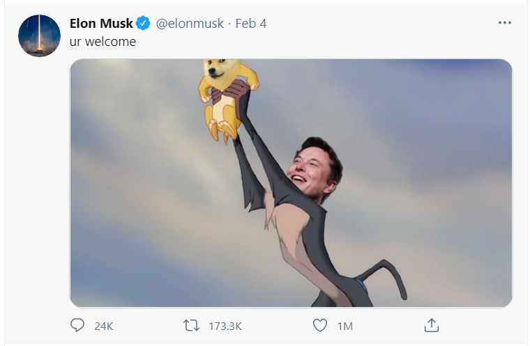
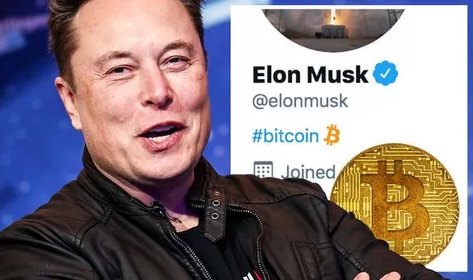

# 前言

毫无疑问的是：区块链是一场革命。 你可以拥抱它，也可以让道与它。它会像上个世纪九十年代的互联网一样蓬勃发展，终有一天成为你生活的必需。 

毫无疑问的是：区块链是一场革命。 你可以拥抱它，也可以让道与它。它会像上个世纪九十年代的互联网一样蓬勃发展，终有一天成为你生活的必需。 

我们强烈建议九零之后的年轻人积极拥抱它，因为“区块链时代”是属于你们的时代，当仁不让，就应该是你们的态度——其实也是你们应该担负起来的职责！

**花边：**

马斯克一轮操作之后：[Bitcoin price news: BTC spikes 20% after Elon Musk adds \#bitcoin to Twitter bio](https://www.express.co.uk/finance/city/1390940/bitcoin-price-news-btc-spike-elon-musk-twitter-bio-gamestop-evg)。

紧接着就是新闻 [Tesla buys $1.5 billion in bitcoin, plans to accept it as paymen](https://www.cnbc.com/2021/02/08/tesla-buys-1point5-billion-in-bitcoin.html)，人们这才发现特斯拉已经在一个多月前就投资了比特币。丰田、大众、戴姆勒（奔驰的母公司）、宝马、福特……会不会都慌了？

紧接着就是新闻 [Tesla buys $1.5 billion in bitcoin, plans to accept it as paymen](https://www.cnbc.com/2021/02/08/tesla-buys-1point5-billion-in-bitcoin.html)，人们这才发现特斯拉已经在一个多月前就投资了比特币。丰田、大众、戴姆勒（奔驰的母公司）、宝马、福特……会不会都慌了？

我并不建议大家去买比特币或者狗狗币，他们的使命已经完成并且未来也很难进入区块链主流市场。不过区块链的确和“币”息息相关，我们很快会看到：几乎每个区块链项目都至少有一个自己的“币种”，因为不少项目都是独一无二的创新项目，那么这些币种在市场里的表现也确实很香：



所以除了区块链的理论，建议大家学点投资理财知识（Youtube或者自主式学习平台上很容易找到学习课程），对你未来发展一定能起到如虎添翼的作用。我2020年甚至做了个校外的小教程教大家学习DeFi借贷（:\)）：



## 重要的区块链学习资源

以太坊官网：[https://ethereum.org/](https://ethereum.org/)

Fellowship of Ethereum Magicians：[https://ethereum-magicians.org/](https://ethereum-magicians.org/)

以太坊爱好者：[https://ethfans.org/](https://ethfans.org/) \(有微信公众号）

## 教材开源协作

* 这本教材，也是深圳大学的相关课程的教材。同时开源的还有[《Solidity智能合约开发》](https://u.naturaldao.io/solidity/)课程教材（2018~2019年版）。
* 欢迎协作（包括评论、提问、建议等等）。点击页面左下角的Gitbook链接，登陆后（建议先注册个Github账号，这样本书的所有资源都可以通过它直接授权注册登录），即可参与协作。协作完全是开源的，协议请查阅本文尾部的声明。
* 同时也欢迎读者有任何想法，随时点击下面的图标链接，与我们分享和讨论：

[　　](https://gitter.im/naturaldao/区块链概论?utm_source=badge&utm_medium=badge&utm_campaign=pr-badge)

**作者（暨深大课程讲师）：**

* [周朝晖](https://naturaldao.io/cn/about-cn/23-core-team-cn/33-zhou.html)

**特别感谢：**

* 黄烁萍
* 谭粤飞（《Solidity智能合约开发》课程老师）
* 张华

## 协议声明

《区块链概论》遵循开源协议[Creative Commons Attribution 4.0 International Public License \(CC BY 4.0\)](https://creativecommons.org/licenses/by/4.0/)

This textbook is licensed under a [Creative Commons Attribution 4.0 International Public License \(CC BY 4.0\)](https://creativecommons.org/licenses/by/4.0/)

\*\*\*\*

**捐助自然道大学:**

[https://naturaldao.io/cn/blog-cn/59-donation-cn.html](https://naturaldao.io/cn/blog-cn/59-donation-cn.html)

