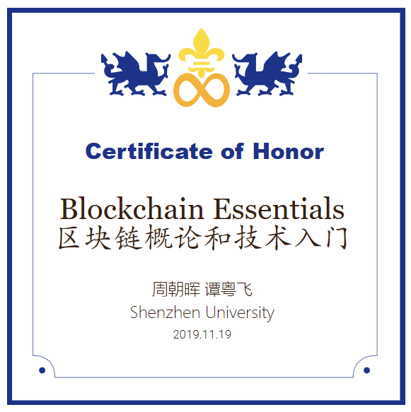

# 前言(ver 2023)

## 致敬2022年在读的所有中国大学生！

2022年我们达成的一个伟大的共识是：成功有个常被忽略的元素叫勇气。当我们鼓起了勇气，我们就可以无惧面对落后的文明和数不清的野蛮人——在当下这个大时代勇气能够助你做出正确的选择！

2023年4月，我惊喜地看到台湾的年轻人也行动起来了。柯文哲先生极有可能引发我们对人类社会治理的一些重要的讨论。柯文哲21年12月18日晚在脸书发文称，民进党花了5800万（新台币）进行宣传、用仇恨动员……2024年6月30日在桃园出席活动时他呼吁民进党不要每天制造对立仇恨。从我历经两三年的跟踪来看，他显然还没有搞清楚”统治“的本质，因而严重低估了执政者的野蛮程度。现在他已被无辜关押10个月。赖政府就是要致其于死地，不要说国际性的人权组织，但凡是“主流新闻”，都一丘之貉，就得视若无睹！

而此前的乌克兰反俄罗斯侵略的战争，和此后的以色列的消灭恐怖组织哈马斯的战争，也意味着全球的文明人不得不仓促间发动一场消灭邪恶势力的总决战。

而所有这些，居然都与区块链息息相关！

我自2017年开始，以自己的实践为基础，精心编写入门区块链必读的内容，且每年都不断修订。这就是本教材的来历。Gitbook的编辑器对中文的支持很糟糕，PDF导出的福利又突然被取消（Gitbook能给我们免费的服务已经够好了），VPN偶尔会崩溃等等，加上这个该死的动荡不安的时局，我的工作也确实很不容易。

如果你想以最短的时间了解区块链，那么我的[《区块链入门极简版》](https://u.naturaldao.io/be/lite/bitcoin)无疑就是最佳的选择了。

这是我本人发起的人类新文明的治理项目：[道易程](https://daism.io)。道易程构建出一个继承了比特币的PoW工作量证明的治理思想的新的治理共识：[PoL爱的证明](https://learn.daism.io/zh/docs/pol.html)。

<figure><figcaption>
这是某学期我发行到链上的课程纪念证书
</figcaption></figure>

## **什么是区块链？**

<figure><figcaption>
布达佩斯的区块链奠基人中本聪的雕像
</figcaption></figure>

如果你急于了解技术上的解释，[请点击此处](chapter4/4.16-wrong-classification.md)。

_最朴素的解释是：区块链始于一场技术革新，其本质即为金融革命，因此也必将引发一场声势浩大的全面而彻底的人类社会革命。它的指向是富爱文明（Proof-of-Love Civilization）。_

值得一提的是，人类迄今为止所创建的所有“文明”，都是非常严重的异化体。马克思的哲学思想揭示，我们甚至还处于人类文明的史前时代！

所以，我们曾认为互联网能够消除人类所有的隔阂和偏见。几乎所有人都以为人类已经走过蒙蛮时代，但尴尬的是，所有的网络媒体，从Facebook到Twitter到微博到微信到TikTok再到假模假样声称要纳入ActivityPub协议的Treads，无论是采用公司治理策略还是国家治理策略，都无法还互联网以朗朗乾坤。甚至哈马斯恐怖组织的暴行，都无法唤醒全球各地无数人的良知——包括多国首脑和联合国高官。

中心化权力是野蛮人生存的沃土，是人类异化的力量，人类世界以中心化权力构建起来的治理体系，从权力体系到司法体系，都该被彻底革新了！好在，当前我们正在经历的乱象，就是资本主义穷途末日的表现。而一旦你注意到区块链的本质之一是币（通证）的匿名，结合抗审查、自运行的智能合约，我们就能洞见正在蓬勃发展的人类文明的一次重大升级：从中心化治理迈向去中心化治理！

**所谓区块链革命，就是人类的中心化文明向去中心化文明的一次伟大的升级，是我们迈向马克思哲学思想中真正美好的人类社会即共产主义的伟大实践（praxis）。**

2017年智能合约的应用爆发后，我马上意识到 AI 公共化的基础已然落地，区块链将是 AI 应用最好的拍档。

这也就意味着：区块链将会携手 AI 实现真正的'人类文明！

## 我要学习区块链知识吗？

如果你是九零之后，基本上已经没啥必要。但如果你真感兴趣，那没问题。

## 重要的区块链学习和交流资源

以太坊官网：[https://ethereum.org/](https://ethereum.org)

道易程：[DAism.io](https://www.daism.io)

Fellowship of Ethereum Magicians：[https://ethereum-magicians.org/](https://ethereum-magicians.org)

登链社区：[https://learnblockchain.cn/](https://learnblockchain.cn/)

以下是我深圳大学本课程里使用的全部幻灯：

[《第一讲：比特币》](https://gamma.app/public/oug008jsizvdf6m)

[《第二讲：钱包》](https://gamma.app/public/5oidxu6ccbl7058)

[《第三讲：以太坊》](https://gamma.app/public/isr1fufkvs2rs2a)

[《第四讲：通证标准的进化与应用》](https://gamma.app/public/xexkougwu8ri1ra)

[《第五讲：去中心化交易与支付》](https://gamma.app/public/n5jvkm2l0kq1p86)

[《第七讲：以太坊改进提案》](https://gamma.app/public/wkj71uz00cwwux1)

## 教材开源协作

* 这本教材，也是深圳大学的相关课程的教材。同时开源的还有[《Solidity智能合约开发》](https://u.naturaldao.io/solidity/)课程教材（2018\~2019年版）。

**作者（暨课程主讲老师、**[**道易程**](https://www.daism.io)**联合创始人）：**

* [周朝晖](https://naturaldao.io/cn/about-cn/23-core-team-cn/33-zhou.html)

**特别感谢：**

* 黄烁萍
* 谭粤飞（《Solidity智能合约开发》课程老师）
* 张华

## 协议声明

《区块链概论》遵循开源协议[Creative Commons Attribution 4.0 International Public License (CC BY 4.0)](https://creativecommons.org/licenses/by/4.0/)

This textbook is licensed under a [Creative Commons Attribution 4.0 International Public License (CC BY 4.0)](https://creativecommons.org/licenses/by/4.0/)

***

**捐助自然道大学**

**（暂停）**

## **其它学习资源推荐**

[《马克思哲学革命及其当代意义》](https://www.bilibili.com/cheese/play/ss6838?fromspmid=sxgoumai)（复旦大学哲学院王德峰教授）

[《观念经济学》](https://www.bilibili.com/cheese/play/ep43294)课程（[黄江南教授的哔哩哔哩空间](https://space.bilibili.com/1432646173)、[YouTube频道](https://www.youtube.com/channel/UCsd7xYZzbCQrmjLwGLnps9w)）

《千年金融史》（副标题：金融如何塑造文明 从5000年前到21世纪）


【美】威廉·戈兹曼（William N.Goetzmann）



【英】哈耶克（经济学家、政治哲学家，诺贝尔经济学奖得主）


[《写给大中华年轻人的公开信》](https://www.notion.so/daism/62912f3ea50840039db4356511a39899)我在热门话题山河大学爆发前几天动笔写的。

[快樂營利社會企業 For-profit Social Enterprise](http://pingchu.com/?p=290)

[资本战争：普通人如何应对？——全球经济衰退（上）](https://www.youtube.com/watch?v=elxl5p0wDSg\&t=19s)

[资本战争：普通人如何应对？——全球经济衰退（下）](https://www.youtube.com/watch?v=TpuQHhuliMU\&t=103s)

[Caught in Providence（YouTube）](https://www.youtube.com/c/CaughtInProvidence)

《苦难的时代：美国奴隶制经济学》\[美] 罗伯特·威廉·福格尔，等（Robert William Fogel）

[《重要提示 - 面对奥密克戎我们应该做什么？](https://zhous98.gitbook.io/mian-dui-ao-mi-ke-rong-wo-men-ying-gai-zuo-shen-me/)》（周朝晖、Fiona，2022年2月26日）

[白纸运动](https://lilaoshibushinilaoshi.com/category/%E7%99%BD%E7%BA%B8%E8%BF%90%E5%8A%A8/)


\[加] 唐塔普斯科特（Don Tapscott），亚力克斯·塔普斯科特


[《我们都是比特币》](https://www.youtube.com/watch?v=C50-2WN-IRc)张张

《孤勇者》（陈奕迅）

《一无所有》（崔健）

《中国孩子》（周云蓬）

《存在》（汪峰）

《春天里》（春天里）

《父亲写的散文诗》（李健）


不听老人言，吃亏在眼前？

