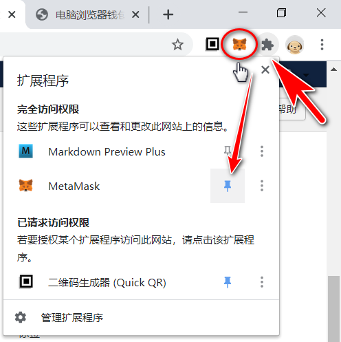

# 2.2 电脑钱包安装

## 电脑钱包安装

电脑钱包实际上也分两种：浏览器钱包和app钱包。

你的电脑必须先安装Chrome或者Firefox浏览器。360浏览器因为采用了Chrome的核心也可以。

准备好笔和纸。别说我老土，不要只用电脑备份助记词！更不要用手机拍照保存助记词，不要用任何app记录助记词。如果纠结的话你就去网购个保险箱，我是认真的，哈哈哈……

***

**Chrome或者Firefox浏览器的安装流程大同小异，以下主要以Firefox为例。**

#### 火狐浏览器FireFox

安装浏览器插件当然在浏览器里面就可以，有的人会建议你去官网，这样当然也可以……

一分钟的事，你要加油哦！

**第一步：点击浏览器右上角**

**第二步：搜索MetaMask**

**第三步：点击MetaJask插件名称**

\
**第四步：添加MetaMask到Firefox**

**第五步：浏览器右上角可以看到MetaMask图标了**

**第六步：创建钱包并接受协议**

**第七步：创建钱包，但从现在开始就要拒绝把密码交给第三方保管**

**第八步：拿出你的笔和纸，备份种子密语（又叫种子密码、助记词）。不备份是无法进行下一步的。**

****

**第九步：确认种子密码（助记词）**

**第十步：钱包安装就绪，准备开启你新的人生**

***

#### 谷歌浏览器Chrome

谷歌浏览器里安装MetaMask钱包和火狐浏览器基本一样，一分钟的事。你要加油哦！

**第一步：点击浏览器右上角？不，我讨厌谷歌浏览器迷宫一样的浪费时间的扩展管理操作！请直接输入以下网址：**

[https://chrome.google.com/webstore/category/extensions](https://chrome.google.com/webstore/category/extensions)

为什么钱包里面都英文？这是一个全球化时代，经过很多年的自废武功，中文已经支离破碎，还是学会看一点英文吧——反正你很多时候没得选择。 &#x20;

**固定MetaMask插件到浏览器右上角。**

**即使是学习，你也必须要有一点支付手续费的ETH，请参考“佛系区投”的《**[**安全买卖ETH（去中心化场外交易）**](https://bcinvest.me/course/53-buy-eth.html)**》。**
