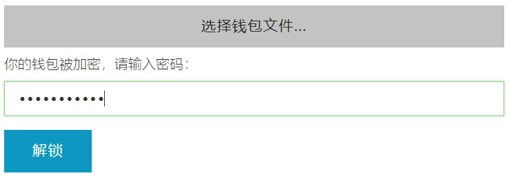

# 2.6 MyEtherWallet钱包的使用

和比特币不同，以太坊是以智能合约功能为核心的DAPP开发平台，因此以太坊钱包能实现的功能要远比比特币钱包丰富。譬如BIP44的规则使得以太坊多层确定钱包能以很小的工作，存储以太坊平台任何项目发行的代币。以太坊钱包还能让用户直接登陆Uniswap这样的以太坊去中心化应用。

譬如如果某人参与一个区块链DAPP项目的投资，那他通过MyEtherWallet钱包，借助智能合约的合约地址，转账ETH就能直接获得它发行的代币。

这个过程就像去ATM取款一样方便。不需要人工服务。

### MyEtherWallet钱包简介

MyEtherWallet常被业界简称为MEW。

在线钱包网址：[https://www.myetherwallet.com/](https://www.myetherwallet.com/)

特色：

1. 界面简洁，适用于新手。
2. 与硬件钱包（如Nano S钱包）成为时尚搭配。
3. 如果没有硬件钱包的配合，本身是一个浏览器钱包，通过访问myetherwallet.com，即可使用。鉴于浏览器的安全性较差，此时不适合保存大额资产。
4. 如果没有硬件钱包的配合我们建议离线使用该钱包：

访问[https://github.com/kvhnuke/etherwallet/releases/latest](https://github.com/kvhnuke/etherwallet/releases/latest)，下载文件包etherwallet-vX.Y.Z.zip，解压到电脑里，双击index.html，即可在你的电脑里使用这个钱包。

1. MyEtherWallet只给你提供一个地址。你的ETH和你投资的所有其它代币（token），都可以共享这个地址。

### 生成钱包和转账

1. 看习惯中文的人儿呢，就直接选「简体中文」吧，如果英语好，直接看英语就可以。

首先，输入一个强密码（最好是数字、小写字母、大写字母、特殊符号什么的都来一遍，不过自己一定要记住，最好在安全的地方做个备份），然后点击「生成钱包」。

2、Keystore File（UTC / JSON）这个文件对钱包的恢复相当重要，最好找个安全的地方备份它，点击“下载Keystore File（UTC / JSON）」”（必须先下载），再点击“I understand.Continue.”（我明白。继续）。

3、Keystore File、JSON文件和私钥可以选择其一进行保存。保险起见是Keystore File、私钥和密码都保存到安全的地方。

* 要保存私钥直接拷贝出来就行了。
* 你可以打印出你的纸钱包，或者存储二维码（你的私钥）。
* 最后点击「Next: Save your Address」（下一步：保存你的地址）——这一步其实应该是访问你的钱包。

1. 选择其中一种方式解锁钱包，下面我先介绍“Keystore / JSON File”这种默认的方法：

点击“**Keystore / JSON File**”：

* 选择左边的「私钥」，然后在中间输入框中将刚才保存的私钥复制粘贴进去，点击「解锁」（好简单）。

点击“选择钱包文件”后，输入密码，点击“解锁”：

* 你马上会看到你的钱包地址（可以复制它），右下方你以后还能看到它上面的其它代币：

* 注意左边显示的地址只是一个示范地址。你要把对方的收款地址拷贝进去。把下面的信息都填写好。有的时候你还要点击下面的“高级功能：增加更多Gas或者数据”，然后填写好数据：
* ICO的时候，地址一栏填写的就是ICO项目里提供的合约地址（contract address）。

点击“生成交易”，再点击“发送交易”：

### 三种备份和使用私钥方式的区别

* Keystore File \(UTC / JSON，已加密的文件\) ——既然是已加密，使用时就一定需要你的密码（下面两种方法都不需要你的密码）。这个Keystore/JSON文件和Mist、Geth使用的钱包文件是一样的，所以将来你可以非常容易地通过Mist、Geth导入你在这创建的钱包。我们推荐下载和备份这个文件。切记别弄丢这个备份文件，也千万别忘了你的密码，否则你的钱就再也不属于你了！
* JSON文件（未加密）——这是你的未加密JSON格式的私钥文件。这意味着你发送交易时不需要密码，也意味着拿到这个JSON文件的任何人都可以无需密码进入你的钱包，动用你以太系的所有数字货币。
* 私钥（未加密）——这是未加密的文本格式私钥文件，用它发送交易也不需要密码。如果某个人拿到了你的未加密的私钥，也就有了你资产的百分百的控制权。出于这个考虑，专业人士一般会推荐你使用第一种方式备份和使用你的密钥。也许你会说我可以把这个私钥保存到一个非常隐秘的地方，譬如打印出来，夹到一本书里，然后把书借给别人……或者家里没起火但书被虫蛀了。别成为悲剧的戏精，好吗？

### 参考文献

1. 《精通比特币》（第2版）:

[https://legacy.gitbook.com/book/wizardforcel/masterbitcoin2cn/details](https://legacy.gitbook.com/book/wizardforcel/masterbitcoin2cn/details)

1. 《Node.js开发加密货币》：[https://bitcoin-on-nodejs.ebookchain.org](https://bitcoin-on-nodejs.ebookchain.org/)
2. 分层确定性钱包 HD Wallet 介绍：[https://zhuanlan.zhihu.com/p/30297080](https://zhuanlan.zhihu.com/p/30297080)
3. EIP 85：[https://github.com/ethereum/EIPs/issues/85](https://github.com/ethereum/EIPs/issues/85)

