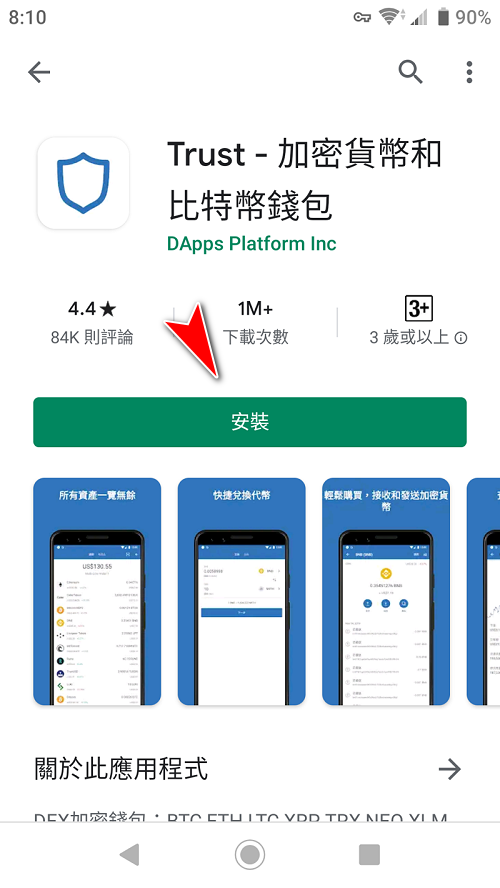
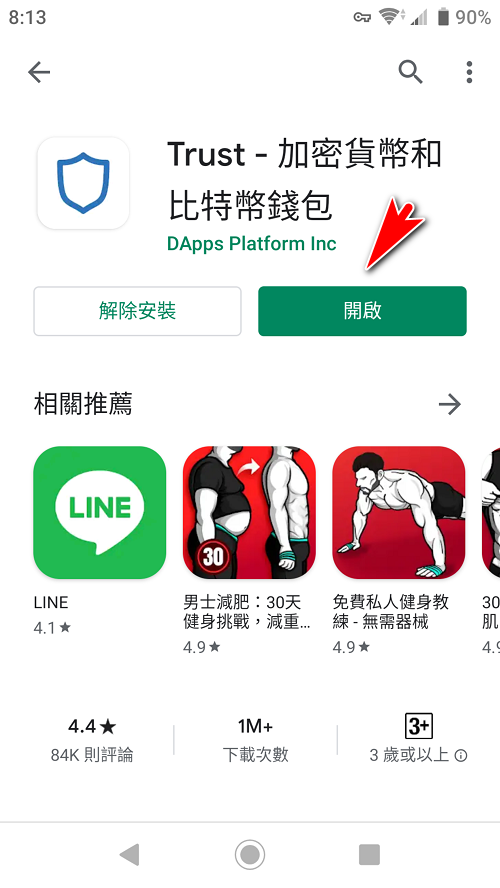
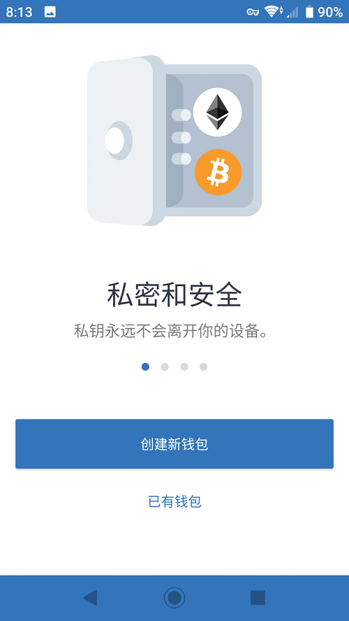
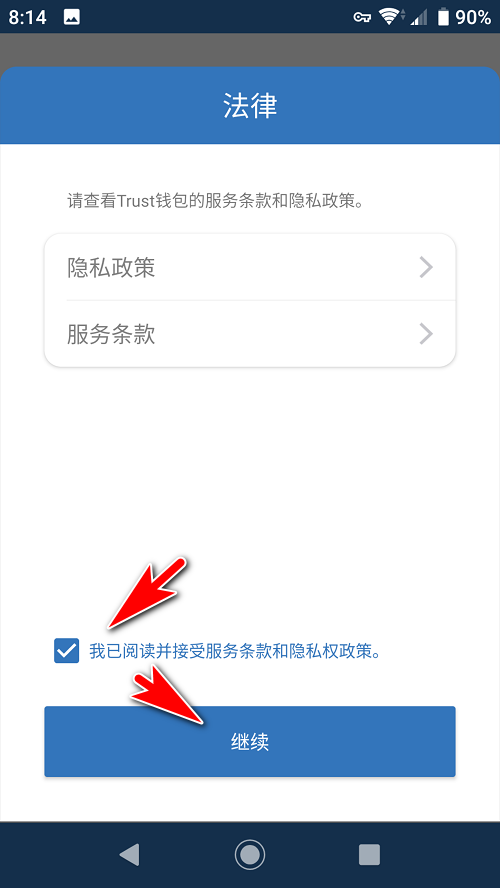
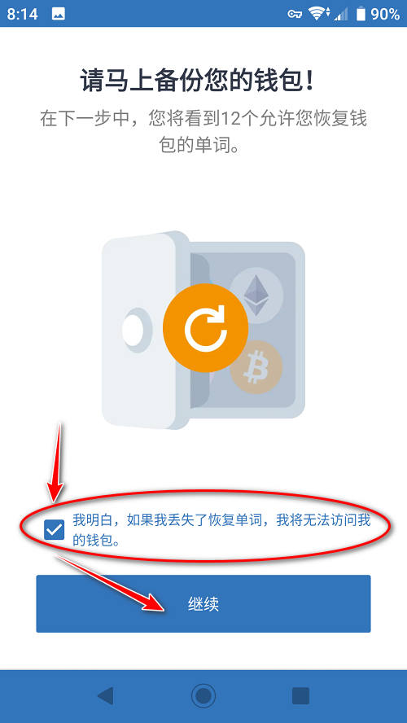
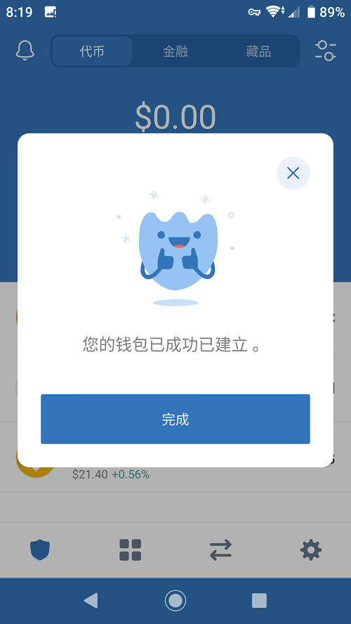
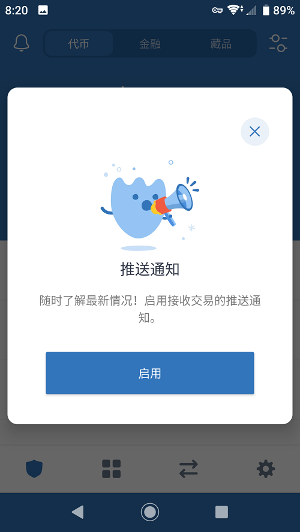
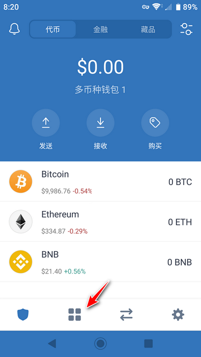
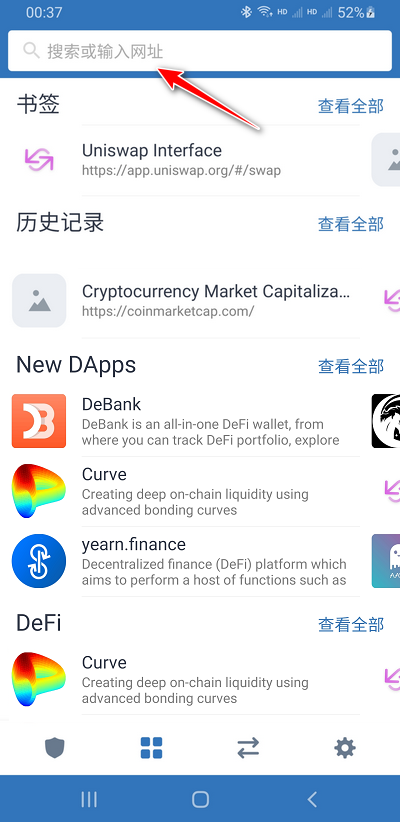

# 2.1 手机钱包安装

本文首发于“[佛系投资](https://bcinvest.me/course/54-trust-wallet.html)”。这里只节选了部分内容。

**请注意：imToken等手机钱包的安装也都大同小异。**

Trust Wallet同时支持安卓手机和iPhone，通过Google Play或者苹果应用商店iTunes Store（App Store）安装即可。BTW，国行iPhone请换安卓手机除非你已经……

如你的安卓手机无法访问Google Play，请去官网直接下载apk文件安装钱包。

手机访问：[https://trustwallet.com](https://trustwallet.com)

***

**第一步：官网下载**

下载后直接安装。

当然如果通过Google Play就更简单了：

（什么情况……知道我最近长膘了吗……）

**第二步：创建新钱包**

请准备好纸和笔

最好写下你的种子密码（助记词），因为现在它禁止你截屏！

以下是我拍的照片，没有美颜相机……

下一步是测试你有没有记下你的种子密码（助记词）。它会让你按顺序排列出12个单词，因为无法截屏我也懒得拍照……你自己看着办吧。

钱包创建完成，你一定要记得把刚才记录的助记词放到一个安全的地方（譬如防火的保险箱）。

启用通知有个好处，如果钱包收到ETH，或者某些与智能合约相关的操作完成了，会通知你！

**第二步：ETH相关的收币、地址复制、二维码收款、发币操作**

请自行摸索，或者Google下其他人的教程。&#x20;

你甚至可以通过Visa卡购买ETH，这是有限额的，只能买一点点。

***

点击钱包最下方有点像“纪梵希”的四个方块：

你可以选取你想要使用的dApp，你也可以输入网址直接访问应用。

## 以太坊账户革命：账户抽象化

详见“EIP-2938”。
