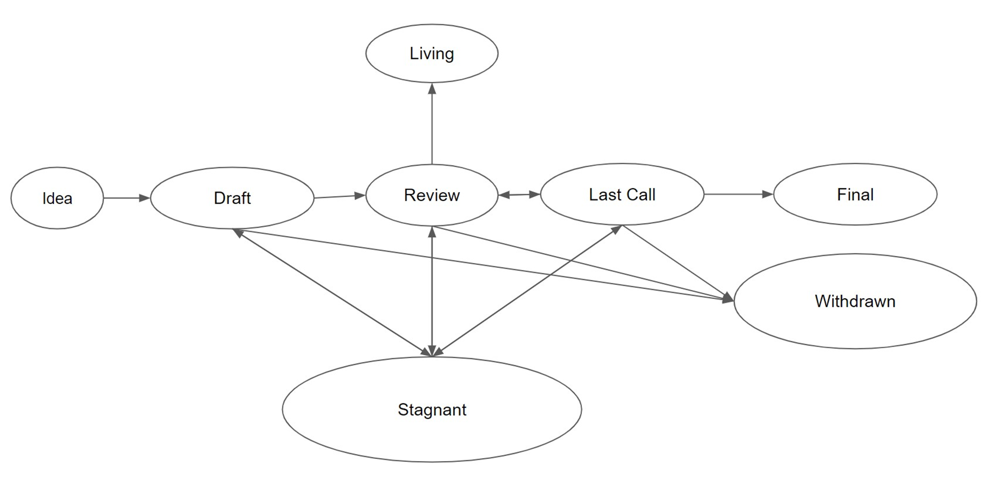

# 2.1 钱包基础知识

## 私钥、公钥和地址

你的各种“币”，都在你的钱包地址里。你给某个钱包地址转账时，钱包会动用你的私钥对交易进行签名，在公钥的配合下广播这笔交易。

私钥、公钥和地址这三者长得相似，且也密切相关：私钥是钱包根据密码学原理生成；私钥通过其它密码学原理生成公钥，公钥再生成地址。有了某个地址的私钥，您才能使用它收款或转账。

譬如比特币通过生成一个随机数，并对它进行SHA256哈希运算，再通过Base58Check编码转换而生成私钥；之后使用某个椭圆曲线算法将私钥转换为公钥，公钥再通过哈希算法和Base58Check编码转换得到地址。有了某个地址的私钥，您才能使用它收款或转账。

私钥固定长度为256位（是从0到2256-1之间的任意值，近似于10的77次方。人类可观测的宇宙中的原子数目前约为10的80次方），使用十六进制表示如下：

6954ac6d0402d7239f1cc150da224d0ef08fd1226f245f06fe4d6d68accfce8a

更多参考：[https://shniu.github.io/2018/08/15/blockchain/wallet-intro1/](https://shniu.github.io/2018/08/15/blockchain/wallet-intro1/)

在区块链里私钥至关重要！它解决了其它一切手段都望而却步的怎么证明“你妈是你妈”的难题。对于你自己的资产，你毋须证明，因为私钥在你手上，其它任何人都休想能染指你的财产。这个世界从此少了很多被他人巧取豪夺、打家劫舍、掐尖落钞的烂事。

在日常交易中除非使用纸钱包，否则您通常并不用操心私钥公钥是什么，只要懂得使用钱包转账就足够了。

地址是一串很长的字符串，譬如这是某人接受比特币打赏的地址及其二维码：

1KorAWmhGaEnedUviL4rXPfsrHCB7ZVFoB

对于私钥，我们要先牢记四个简单的区块链基础逻辑：

* 私钥是不可能被假冒的。
* 私钥是完全私有的密钥，它应该自始至终都密不示人。因此在通常的支付场景下，你永远不应该出示你的私钥，你顶多需要使用私钥对你的转账进行签名—— 这个流程一般是钱包自动帮你做的。
* 谁拥有某个地址的私钥，谁就是该地址上的那笔数字资产的主人。
* 这是一个将人匿名的零知识证明！说明区块链应该坚持匿名原则！

零知识证明\(Zero—Knowledge Proof\)，是由S.Goldwasser、S.Micali及C.Rackoff在20世纪80年代初提出的。它指的是证明者能够在不向验证者提供任何有用的信息的情况下，使验证者相信某个论断是正确的。

## 比特币找零地址和以太坊账户地址

比特币转账和以太币转账不同的是，它会将全部数量的比特币从某个或某几个地址发送出去，将需要支付的数量打到收款方的地址上，并将剩余的比特币打回到自己的一个新地址亦即“找零地址”上：

比特币的这个模型叫UTXO模型。UTXO英文全称为：Unspent Transaction Output，翻译为中文为“未花费交易输出”。理解UTXO最简单的方式就是类比我们平时使用的纸币：支付是交易输入，收款是未花费的交易输出。

“找零地址”在一些新版钱包里可自行设置。但比特币显然不建议设置为原地址，那样不安全。

同样因为比特币可以被跟踪，每次转账都需要向对方出示公钥和地址，为安全起见，比特币建议每次支付的时候，也都使用新的地址（实际上私钥、公钥和地址就全部换新了）。

比特币其实并没有所谓的账户。而以太坊的账户模型则跟我们通常所理解的账户概念是一致的。

以太坊中有两种账户地址：

* 外部账户（Externally Owned Accounts，EOA）地址：我们常用的存储自己代币的账户地址。外部账户由私钥控制。
* 合约账户（Contract Accounts，CA）地址：只受智能合约代码控制的账户地址。

以太坊正在试图模糊二者的界限，即你可以同时拥有合约账户和外部账户，这种做法本质上就是让用户按照合约账户的格式来定义外部账户。一旦这样做，代码支持密钥将用户特殊的标识加入到交易中，可是这又有什么用呢？因为你可能会说随着量子计算机的发展，它会让加密货币变得不那么安全，假设你想保存一笔被量子计算机攻击过的交易，那又该怎么办呢？随着“抽象账户”的实施，你可以使用签名机制就像哈希梯子一样来定义你的账户，这样你的账户就会具备量子级别的安全性，同时你的账户也会完全变成可定制化，就像智能合约一样。

另外，2020年年底以太坊创始人V神等几个人发起了技术提案Acount Abstraction（EIP-2938），准备提升合约账户的作用，使之也能像外部账户一样支付手续费并触发交易的执行。这也就是说，没有了人类之手，区块链dApp一样可以在其它外部条件的触发下，自行启动其它操作，包括主动与其它合约交互！这一提案，非特斯拉的自动驾驶可以相提并论，意义深远！

在以太坊账户中，我们维护以下几个状态：

* nonce：外部账户为交易次数，合约账户为创建的合约序号。
* balance：该地址的以太币余额。
* storageRoot：账户存储内容组成的默克尔树根之哈希值。
* codeHash：账户EVM代码的哈希值。外部账户为空字符串的哈希值，合约账户为合约代码的哈希值——请注意只是合约代码的哈希值。以太坊智能合约部署后会创建一个合约账户,合约账户里保存着智能合约的编译之后的可执行字节码\(在EVM里执行\)，并且有存储空间,合约能对合约账户的空间写入信息。

UTXO模型的优点：

* 隐匿性比较强，理论上可以为每一笔输出设置一个地址。
* 无需维护余额等状态值。
* UTXO是独立数据记录，可以通过并行极大的提升区块链交易验证速度。
* 无需关心事务问题，只需要关心输出脚本即可。
* UTXO无法分割，每次交易都需要多个输出，分别为支出与找零。

账户模型的优点

* 可快速获取账户的余额，而比特币需要将指定地址所拥有的所有UTXO中的未花费交易总值整合。
* 节省记账空间，因为每笔交易只有一个输入一个输出。
* 可以较容易的实现图灵完备的智能合约——这一点，让以太坊已经拔高一个维度，超越了比特币的电子现金的定位，对于区块链的发展意义非凡！

## 比特币钱包的选择

收集了来自68个不同国家反馈的“Bitcoin Survey 2016”的调查结果：

“对于密码学货币爱好者来说，丢失比特币是另外一个重大的挫折。16%的受访者表示由于交易所被黑而丢失过资金……12%的受访者表示无法访问他们的钱包而丢失过比特币。在大部分情况下，是因为丢弃设备而且没有进行钱包备份财导致了这种情况的发生。”

结论：

* 中心化交易所经常被黑客入侵，是最不安全的地方——但在得到那么多惨痛的教训后，大多数交易所采用了冷热钱包分离的手段（个别大型交易所甚至采用百分百冷钱包，完全由人工提供手工服务），保证即使黑客入侵，也只能黑走热钱包里的比特币，让全部损失控制在15%之内。
* 务请记得及时备份您的钱包！如果你嫌有的钱包麻烦，我给您推荐这个钱包：Coinomi。
* 不要给钱包设置过于复杂的密码！

在钱包的推荐方面，做得最好的是bitcoin.com：

[https://bitcoin.org/zh\_CN/choose-your-wallet](https://bitcoin.org/zh_CN/choose-your-wallet)

现在已有下列钱包可供选择：

Bitcoin Core、Bitcoin Knots、MultiBit HD、Armory、Electrum、mSIGNA、Bitcoin Wallet、breadwallet、Bither、GreenBits、GreenAddress、Coinomi……

官网特地用了随机排列的方式推荐比特币钱包。以上排列也是随意的。

如果您想自己好好选择一个钱包，那么您要先搞懂这些概念：

**资金的掌控权**——指您对资金究竟有多大的控制权。其中一般有两种情况：

1. 资金掌控权（Control over your money）——这个其实应该翻译为“完全自控权”，因为是您全权掌控自己的资金，没有任何第三方帮您管理资金，也没有任何第三方可以冻结或是弄丢您的比特币，您自己全权负责，出了问题没人能帮您！Coinomi采用的就是“完全自控权”，但它通过一个技术机制，大大降低了“完全自控权”的使用风险，后面马上就有细节介绍！
2. 共享的资金掌控权（Shared control over your money）——交易时需要第三方一起授权才可以完成。比如GreenAddress 钱包要求每一笔交易都必须由您和第三方一起授权才能完成。如果您使用的是 GreenAddress ，而又想改为全权掌控自己的资金，您可以使用原始备份或者之前通过邮件发送给您的已签名交易来重新获得完全自控权。如果您看不懂这句话的意思，又怕第三方耽误事，那么您最好不要选择这种钱包。

**交易验证**——您的钱包涉及一笔交易时，它通过怎样的机制来完成交易的验证：

1. 全面验证（Full validation）——就是使用区块链的全部数据来进行验证交易。专业上叫通过全节点（Full Node）进行验证。这样您的钱包要下载比特币区块链的所有数据（已超过80G），在网速比较慢的吾国，有时候可能需要好几天时间。因为使用全部数据，这种验证无疑是最最安全的交易验证方式。
2. 简化验证（Simplified validation）——技术上讲是简易节点型（SPV Node）验证，就是仅下载Block头部信息，无需交易数据来做验证。安全性不及全面验证，但使用时因为不用下载数据，比较快捷。
3. 分散验证（Decentralized validation）——去中心化验证。这种钱包通过一个列表，随机连接一个服务器进行验证。这意味着在验证支付的时候需要完全信任第三方（您所连接的服务器）。安全性显然也不及全面验证。使用时一般比较快捷。
4. 集中验证（Centralized validation）——钱包依赖于一个中心化管理的机构，直接借助这个机构的服务器上的数据进行验证。这意味着您需要完全信任这个第三方。第三方如果提供假数据或者被黑造成数据被篡改等等情况，都会危及到您的资金安全！Coinomi采用的就是集中验证。

**钱包的透明度**——一般是指钱包的代码的透明度：

1. 完全的透明度——钱包的所有代码都已经开源，任何人都可以看到钱包的全部代码。这样钱包有没有造假就一目了然了。
2. 基本的透明度——钱包的客户端，或者说您安装到电脑或者手机里的那部分的代码，已经开源。不过这毕竟只是客户端这部分开源，还有一部分是在一个黑匣子里的，这就需要您去信任开发团队或相关公司。Coinomi就属于这种情况。

**环境的安全性**——电脑容易受恶意软件攻击，其安全性很低，手机环境则相对安全很多，所以电脑环境属于脆弱的环境，手机环境属于安全环境。

1. 安全环境（Secure environment）——无电脑版，只能安装到手机里。Coinomi属于这种情况。
2. 脆弱的环境（Vulnerable environment）——有电脑版。

**隐私性**——您的交易信息是否会被泄露：

1. 增强的隐私性（Improved privacy）——通过滚动地址（每次交易都使用一个新的比特币地址）的方式来大大增加窥探您的余额和支付历史的难度；交易时钱包不会在网上给其它节点披露敏感信息；并允许利用匿名网络Tor来防范攻击者或防止互联网服务供应商把您的支付和您的IP地址联系在一起。
2. 基本的隐私性（Basic privacy）——也通过滚动地址（每次交易都使用一个新的比特币地址）的方式来大大增加窥探您的余额和支付历史的难度。但其它节点可能可以在接受和发出支付时登录您的IP地址并把它和您的支付联系在一起；或者钱包不允许您利用Tor来防御攻击者或防止互联网服务供应商把您的支付和您的IP地址联系在一起，甚至或者后两项兼备。Coinomi属于这种情况。
3. 脆弱的隐私性（Weak privacy）——通常是因为钱包重复使用同样的地址，使得任何人都很容易窥探到您的余额和支付历史。或者是因为钱包所使用的是中心化管理的服务器，造成它会披露部分信息给其它节点（比如在接受和发出支付时记录您的IP地址并把您的支付联系在一起）；或者钱包不让您利用Tor来防御攻击者或防止互联网服务供应商把您的支付和您的IP地址联系在一起；或者后三者兼有。

从调查结果可以看出：真正发生率高的危险还不在于钱包本身，而是用户要根据自己的习惯选择适合自己的钱包，并妥善使用。

