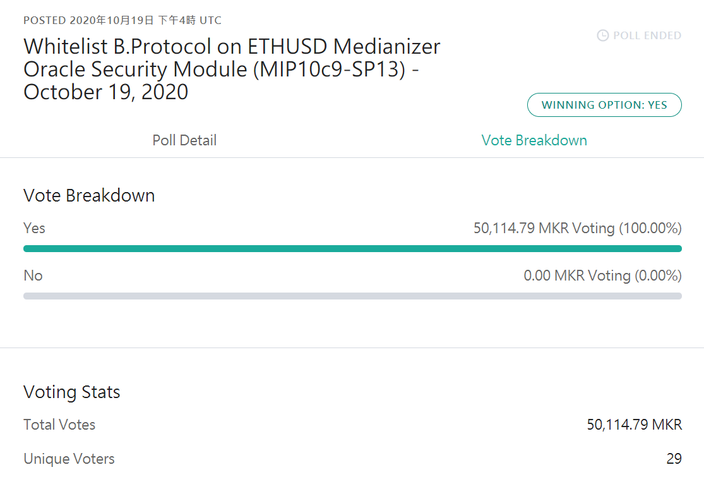

# 5.13 EIP-3156：一种闪电贷标准

## 什么是闪电贷？

在常规贷款中，您需要先准备好抵押资产，然后去特定机构提出申请，然后等待几天乃至几个月，结果可能是批准，也可能是驳回（然后再修订资料再花数天乃至数月）。然后还必须在规定的时间范围内以约定的利率偿还贷款。闪电贷是特殊的，因为这些都不复存在，没有人必须申请，甚至都不需要抵押，并且每个人的闪电贷都会被批准。当然，也没有贷款人能够跑路违约。

闪电贷的基础是智能合约的免许可和可自由组合的特色。

闪电贷是 DeFi 无抵押贷款的新思路，其前提是所有操作都在一笔交易（一个区块，以太坊大约是13秒）中完成，它允许借款人无需抵押资产即可实现借贷。因为代码保证同时偿还借款，如果资金没有返还，那么交易会被还原，即撤消之前执行的所有操作，从而确保协议和资金的安全。

闪电贷的最早应用是无担保借贷，由 Aave 于 2020 年初率先推出。

## 闪电贷应用案例

**案例1**

某人通过闪电贷 ，从去中心化加密货币衍生品交易平台 dYdX 借出了 1 万枚 ETH，使用其中 5000 ETH 在 Compound 借出 112 wBTC，另外 5000 ETH 到 Fulcrum（bZx 协议）上开了 wBTC 的空单（最终由Kyber从Uniswap采购），再利用 Compound 借到的 wBTC 去 Uniswap 砸盘，导致 Fulcrum 空仓大赚，然后归还了最初借到的 1 万枚 ETH，在这个过程中，某人获得了价值 35 万美元的 ETH 的收益。所有这些操作，一气呵成！

**案例2**

数天后，黑客贷入ETH，用ETH大量买入sUSD，Kyber上的sUSD价格上升了一倍。此时，bZx认为sUD的价值是2美元而不是1美元。于是攻击者在bZx上用sUSD提取了比正常情况下更多的ETH贷款。最后，攻击者偿还了原来的ETH贷款，并带著剩下的ETH跑了。

\*\*案例3：\*\*B.Protocol操纵 MakerDAO 治理投票事件

DeFi 流动性聚合协议 B.Protocol 因为希望被加进 MakerDAO 价格预言机的白名单中，就在 MakerDAO 的治理投票中，利用闪电贷大量借入 MKR 藉此获取大量投票权，成功让提案以“100% 得票率”通过。

B.Protocol 先用 5 万枚 ETH 透过 dYdX 和 AAVE，借出 1.3 万枚 MKR 治理代币，锁定借出的 MKR 并对其自己的提案灌入大量同意票，接著再解锁 MKR 以将资金迅速返还给借出资产的 AAVE 和 dYdX 平台。



## 要点？

您必须在与收到贷款时的同一笔交易中偿还贷款。从贷方的角度来看，这是完全合理的。如果您立即偿还贷款，贷方就没有风险。因此，他可以将这笔贷款提供给任何需要的人。

同一笔交易中必须偿还的贷款有什么好处？

这无疑极大地限制了您的选择，但由于以太坊的力量，我们仍然可以做很多事情。最常见的是，您可以将其用于套利，同时大幅降低您自己的资本要求。无需在多个账户中拥有数百万美元即可实现利润最大化。而是采取闪贷，在一笔交易中尽可能多地套利，然后在交易结束时偿还贷款。

不幸的是，闪电贷经常被用于黑客攻击。如果某个智能合约中存在有利可图的纰漏，闪电贷款可让任何人利用该错误。黑客常常因此获得数百万美元甚至更高的利润，而不是仅仅获得数千美元。

更新：Alberto 本人提出的另一个很好的用例是债务再融资。 “想象一下，你已经将ETH锁仓到Aave并 借出Dai，为此你需要支付10％的贷款利息。然后你使用Dai买了房子，大概十年都不会还清。现在，Compound 支持你以ETH抵押品借出Dai，仅收取9％的利息。使用Dai的一笔闪电贷，你可以偿还Aave的债务，取回放置在 Compound中的ETH抵押品。你以9％的利率从Compound借出Dai并偿还了闪电带宽。简单地说，你将10％的Aave贷款，再融资为9％的复合贷款。“

## 什么是EIP-3156闪电贷标准？

许多协议都提供了可供任何人使用的闪电贷，例如[dYdX](https://help.dydx.exchange/en/articles/3724602-flash-loans)、[Aave](https://aave.com/flash-loans/)和[Uniswap](https://uniswap.org/docs/v2/core-concepts/flash-swaps/)。不幸的是，这些接口彼此截然不同。这不仅对使用这些闪电贷的用户不利，开发者还必须学习如何在每个生态系统中选用闪电贷。显而易见的是，当这些开发者试图使用其中之一设计自己所需的闪电贷机制时，它们带来的复杂性（噪音干扰太多）对于其dApp的安全性也是不利的。

这就是EIP-3156提出的意义，它旨在支持各种不同的借贷机制。

### EIP-3156规范 <a href="#3eip3156ierc3156flashlender-jie-kou" id="3eip3156ierc3156flashlender-jie-kou"></a>

#### 接口IERC3156FlashLender <a href="#3eip3156ierc3156flashlender-jie-kou" id="3eip3156ierc3156flashlender-jie-kou"></a>

贷方接口必须由想要提供闪电贷的服务实现。函数 maxFlashLoan 和 flashFee 的作用是不言自明的。

使用 flashLoan 函数，您将能够执行闪电贷。接收方地址必须指向一个实现了borrower接口的合约。除了调用之外，还可以传递任意数据。

该函数的实现的唯一要求是您必须从接收器调用 onFlashLoan 回调：

|

```
require(
receiver.onFlashLoan(msg.sender, token, amount, fee, data)
== keccak256("ERC3156FlashBorrower.onFlashLoan"),
"IERC3156: Callback failed"


);
回调之后，该flashLoan函数必须从贷款接收方提取回金额+手续费用，如果失败，则将交易回滚（所有操作一笔勾销）。
| interface IERC3156FlashLender {
function maxFlashLoan(
address token
) external view returns (uint256);
function flashFee(
    address token,
    uint256 amount
) external view returns (uint256);

function flashLoan(
    IERC3156FlashBorrower receiver,
    address token,
    uint256 amount,
    bytes calldata data
) external returns (bool);


}
回调之后，该flashLoan函数必须从贷款接收方提取回金额+手续费用，如果失败，则将交易回滚。
接口IERC3156FlashBorrower
借款方需要实现IERC3156FlashBorrower接口。
该接口仅定义了一个方法即onFlashLoan回调。为了避免交易回滚，在onFlashLoan实现代码中必须授权“金额+手续费”给msg.sender。
| interface IERC3156FlashBorrower {
function onFlashLoan(
address initiator,
address token,
uint256 amount,
uint256 fee,
bytes calldata data
) external returns (bytes32);


}
请注意，通证的类型没关系。在下面的示例中，我们将使用ERC-20，但也可以使用其它通证标准。
EIP-3156闪电贷合约示例
在下面的示例中，我们将在ERC-20合约中实现闪电贷功能。我们将根据需要铸造新的通证，然后在结束时销毁。
借款方合约
下面是借款方合约示例代码：
| function flashBorrow(
address token,
uint256 amount,
bytes memory data
) public {
uint256 allowance = IERC20(token).allowance(
address(this),
address(lender)
);
uint256 fee = lender.flashFee(token, amount);
uint256 repayment = amount + fee;
IERC20(token).approve(
address(lender),
allowance + repayment
);
lender.flashLoan(this, token, amount, data);


}
我们实现了flashBorrow功能。lender指向在部署时定义的IERC3156FlashLender合约。
我们首先授权通证给贷方以偿还总金额。还款额计算为“贷款额+手续费”。我们可以通过调用flashFee方法来获取手续费的具体数额。
最后，我们执行flashLoan方法。
当然，现在我们还需要调用借款方的onFlashLoan回调函数。在示例中，我们执行如下操作：

验证交易发起方确实是贷方
验证闪电贷的发起人确实是我们的合约
返回预定义的哈希值以验证成功的闪电贷

如果需要，我们可以根据传入的额外数据在此处实现其他逻辑。
代码如下所示：
| function onFlashLoan(
address initiator,
address token,
uint256 amount,
uint256 fee,
bytes calldata data
) external override returns(bool) {
require(
msg.sender == address(lender),
"FlashBorrower: Untrusted lender"
);
require(
initiator == address(this),
"FlashBorrower: Untrusted loan initiator"
);
// optionally check data here if wanted

return keccak256("ERC3156FlashBorrower.onFlashLoan");


}
现在，我们可以进入贷方实现，在其中执行实际的闪电贷逻辑。
5.2 贷款方合约代码
让我们从maxFlashLoan函数开始：
| function maxFlashLoan(
address token
) external view override returns (uint256) {
return type(uint256).max - totalSupply();


}
该函数通常可以返回账户余额，但是由于我们新铸造了要求的通证，因此可以允许闪电贷直到totalSupply溢出。
接下来我们让flashFee函数返回总贷款额的0.1％，即手续费为总额的千分之一：
| function flashFee(
address token,
uint256 amount
) public view override returns (uint256) {
require(
token == address(this),
"FlashMinter: Unsupported currency"
);
uint256 fee = 1000; // 0.1 %.
return amount * fee / 10000;


}
借款方和贷款方都需要调用此方法来决定闪电贷的手续费具体数额。
现在我们终于可以实现flashLoan功能了。在下面的代码中，我们将：

向借款人铸造所要求的金额
执行onFlashLoan回调并验证其返回值
检查还款是否被批准
减少还款额并将其销毁

代码如下：
| function flashLoan(
IERC3156FlashBorrower receiver,
address token,
uint256 amount,
bytes calldata data
) external override returns (bool) {
require(token == address(this), "FlashMinter: Unsupported currency");
uint256 fee = flashFee(token, amount);
_mint(address(receiver), amount);

bytes32 CALLBACK_SUCCESS = keccak256("ERC3156FlashBorrower.onFlashLoan");
require(
    receiver.onFlashLoan(msg.sender, token, amount, fee, data) == CALLBACK_SUCCESS,
    "FlashMinter: Callback failed"
);

uint256 _allowance = allowance(address(receiver), address(this));
require(_allowance >= (amount + fee), "FlashMinter: Repay not approved");

_approve(address(receiver), address(this), _allowance - (amount + fee));
_burn(address(receiver), amount + fee);

return true;


}
你可以在这里https://github.com/albertocuestacanada/ERC3156）查看完整的EIP3156合约示例代码。
6、兼容现有闪电贷协议的EIP-3156封装
EIP-3156封装器是个有趣的项目。 它可以将现存的闪电贷协议封装为EIP-3156兼容接口，目前已经支持如下协议：

dYdX
Uniswap
Aave
Yield

其中dYdX的封装器已经部署到以太坊主网。
原文链接：https://soliditydeveloper.com/eip-3156
参考：http://blog.hubwiz.com/2021/05/25/eip-3156-intro/
```
