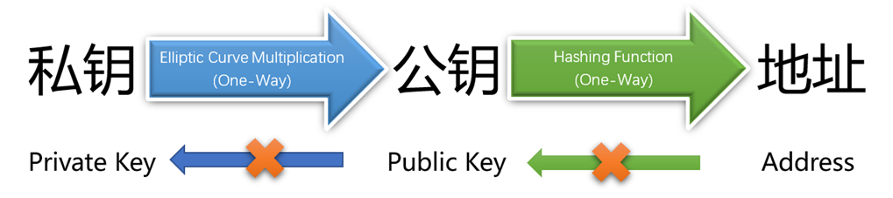
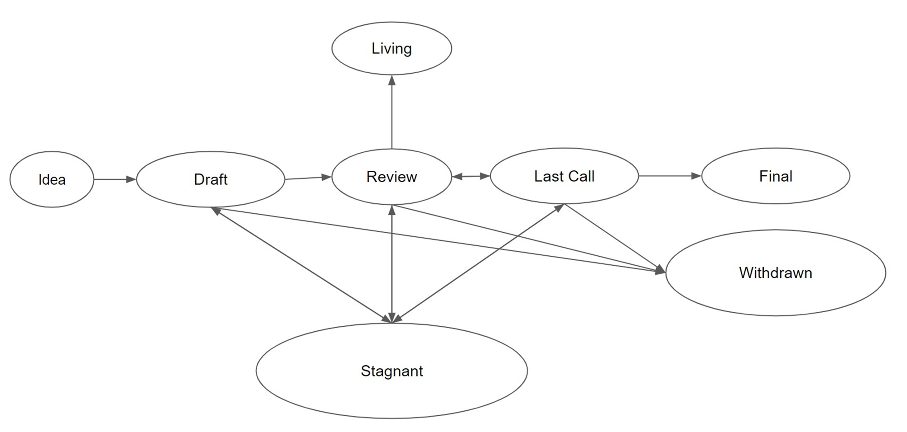

# 2.1 钱包及账户里的秘密

百度百科云：钱包，顾名思义是装钱的包包。

什么是（区块链）钱包？

区块链钱包（以下简称钱包）是让人们能够管理自己的区块链账户，并且与去中心化应用（dApp）交互的工具软件。

显而易见：钱包是区块链的应用入口。

也许你已经注意到，每个公链和每个dApp（去中心化应用），都至少拥有一种具有货币属性的专属通证（token）。我们通常把这个具有货币属性的通证叫做代币。代币有多种作用，譬如安保、奖励、估值等等。[第四章第三节](<../chapter4/4.3 通证（token）及其多样性.md>)将会有详细的介绍。

具体到日常应用，当我们将智能合约部署到以太坊，我们需要通过钱包从自己的账户里支付gas（手续费）。当我们到一个去中心化交易网络里交易代币的时候，我们既需要钱包从自己的账户里转出要卖出的代币接收要买入的代币，还需要用钱包从自己的账户里支付完成这些操作的gas（手续费）。这就是说，在我们使用每个公链和每个dApp的时候，常常需要动用到代币。由于代币是在我们的账户里，要通过钱包才能动用账户，因此这些操作就常常需要钱包才能完成。

大多数区块链钱包都非常像银行，它管理的是你个人的，多个人的，一组或多组人的账户，并且一个人可以在一个钱包里生成、导入并使用多个账户。

但与银行不同的是，钱包和账户并非绑定关系：一个账户可以在多数钱包里使用。你也可以在一个钱包里，拥有任意多个账户。

还有：没有人能够冻结你的账号，撤销你的转账，也没有消费限额……并且无论对方在地球的哪个角落，转账的确认时间都与地域无关。

根据载体的不同，区块链钱包分为计算机钱包、手机钱包、浏览器钱包、硬件钱包、纸钱包和脑钱包等等，这样不管您使用的是何种设备，或者有什么样的需求，都有配套的钱包供您使用。

其中脑钱包因为实际使用时安全性太低，基本已经被淘汰。

硬件钱包是为了离线生成和保存私钥，是目前“公认”比较安全的代币存储方案。代表品牌有[Leger](https://www.ledger.com/)、[Ballet Cryptocurrency Wallet（芭蕾钱包）](https://www.ballet.com/)、[imKey硬件钱包](https://imkey.im/)、[Trezor](https://trezor.io/)。

浏览器钱包的代表为Metamask、Jaxx。

手机钱包的代表为Trust Wallet、MetaMask、imToken、TokenPocket。

因为使用方便、用户群体大，手机钱包已经成为主流。计算机钱包的特点则刚好相反。

## 以太坊账户

以太坊的账户模型则跟我们通常所理解的账户概念是一致的。

一个以太坊帐户是一个可以拥有 ETH 或其它通证余额的实体，可以在以太坊上发送交易。并且其中的通证包括但不限于代币。

帐户可以由用户控制，也可以作为智能合约部署——这样以太坊便有了两种类型的账户：

* 外部所有的账户（常被简称为外部账户。Externally Owned Accounts，EOA）：人类常用的存储自己的通证的账户。外部账户由私钥（或者说私钥的所有者）控制。
* 合约账户（Contract Accounts，CA）：部署到网络上的智能合约。它是只受智能合约代码控制的账户。

这两种账户都能：

* 接收、持有和发送 ETH 和通证（token）。
* 与已部署的智能合约进行交互。

### 两种账户的主要区别 

**外部所有的账户**

* 创建帐户是免费的
* 可以发起交易
* 外部所有的帐户之间只能进行 ETH 和通证交易
* 由三部分组成：地址、公钥和私钥。公钥和私钥是一对加密密钥，它们联合控制帐户的活动。

**合约账户**

* 创建合约存在成本，因为需要使用网络存储空间。
* 目前只能在收到交易时发送交易。
* 从外部所有的帐户向合约帐户发起的交易能触发可执行多种操作的代码，例如转移代币甚至创建新合约。
* 合约帐户没有私钥。 它们由智能合约代码逻辑控制。因为合约代码就是合约账户的组成部分，你可以理解为合约账户目前是由外部请求驱动的，根据代码逻辑和状态（数据）自运行的账户。

### 外部所有的账户之组成：助记词、私钥、公钥和地址 

以太坊账户通常是以上四个部分的复合体。

首先，你的各种“币”，都在你的钱包地址里。你给某个地址转账时，钱包会动用你的私钥对交易进行签名，在公钥的配合下广播这笔交易。

那助记词又是咋回事呢？

很简单，因为私钥记不住，就通过某种算法转为助记词，方便大家备份。

私钥、公钥和地址这三者长得相似，且也密切相关：私钥是钱包根据密码学原理（你可以理解为某个随机法则）生成；私钥通过特定的密码学原理生成公钥（至2023年8月5日，比特币和以太坊外部所有的地址，使用的都是[椭圆曲线数字签名算法↗](https://wikipedia.org/wiki/Elliptic\_Curve\_Digital\_Signature\_Algorithm)），公钥再采用另一个加密算法生成地址。这两种加密算法都保证了只能产生唯一的公钥和地址，且不能反向推算，即不能由地址破解出公钥，也不能由公钥破解出私钥。

譬如比特币钱包通过生成一个随机数，并对它进行SHA256哈希运算，再通过Base58Check编码转换而生成私钥；之后使用某个椭圆曲线算法将私钥转换为公钥，公钥再通过哈希算法和Base58Check编码转换得到地址。

有了某个地址的私钥，您才能使用它收款或转账。

私钥固定长度为256位（是从0到2256-1之间的任意值，近似于10的77次方。人类可观测的宇宙中的原子数目前约为10的80次方），使用十六进制表示如下：

6954ac6d0402d7239f1cc150da224d0ef08fd1226f245f06fe4d6d68accfce8a

总共64 个十六进制字符。

因为私钥非常不便于使用，基本上只能靠拷贝来保存和移动，也就非常危险（譬如从电脑移动到手机，很多人就利用云工具，结果导致被盗）。所以[BIP39协议](https://github.com/bitcoin/bips/blob/master/bip-0039.mediawiki)通过加密算法，将一组英文单词和一个私钥形成单向对应的关系，以方便用户保存和在不同设备间使用。该方法诞生于比特币时代，后来又发生一些算法上的变迁，因此这组英文单词，通常为12\~16个英文单词。

更多参考：[https://shniu.github.io/2018/08/15/blockchain/wallet-intro1/](https://shniu.github.io/2018/08/15/blockchain/wallet-intro1/)

在区块链里私钥至关重要！它解决了其它一切手段都望而却步的怎么证明“你妈是你妈”的难题。对于你自己的资产，你毋须证明，因为私钥在你手上，其它任何人都休想能染指你的财产。这个世界从此少了很多被他人巧取豪夺、打家劫舍、掐尖落钞的烂事。

在日常交易中除非使用纸钱包，否则您通常并不用操心私钥公钥是什么，只要懂得使用钱包转账就足够了。

地址是一串很长的字符串，譬如这是某人接受比特币打赏的地址及其二维码：

1KorAWmhGaEnedUviL4rXPfsrHCB7ZVFoB

对于以太坊的外部所有的账户，乃采用[椭圆曲线数字签名算法(opens in a new tab)↗](https://wikipedia.org/wiki/Elliptic\_Curve\_Digital\_Signature\_Algorithm)从私钥生成公钥。 通过获取公钥 Keccak-256 哈希的最后 20 个字节，在前面按照[EIP85](https://github.com/ethereum/EIPs/issues/85)提案加上0x构成。即总共42 个字符组成的十六进制地址。如：

0xf69451503E7EaEc6fe82E1129316104D2458010a

对于私钥，我们要先牢记四个简单的区块链基础逻辑：

* 私钥是不可能被假冒的。
* 私钥是完全私有的密钥，它应该自始至终都密不示人。因此在通常的支付场景下，你永远不应该出示你的私钥，你顶多需要使用私钥对你的转账进行签名—— 这个流程一般是钱包自动帮你做的。
* 谁拥有某个地址的私钥，谁就是该地址上的那笔数字资产的主人。
* 这是一个将人匿名的零知识证明！说明区块链应该坚持匿名原则！

_零知识证明(Zero—Knowledge Proof)，是由S.Goldwasser、S.Micali及C.Rackoff在20世纪80年代初提出的。它指的是证明者能够在不向验证者提供任何有用的信息的情况下，使验证者相信某个论断是正确的。_

钱包与账户或者某个地址（严格地说是私钥）没有绑定关系，一个账户可以在多数钱包里使用。

**验证者密钥**

以太坊还有一另种类型的密钥，它们是在以太坊从工作量证明过渡到权益证明共识时引入的。 它们是“BLS”密钥，用来识别验证者。 这些密钥可以有效地聚合，减少网络达成共识所需要的带宽。 没有这种密钥集合，验证者的最小质押金额将会高出许多。

[更多关于验证者密钥的信息](https://ethereum.org/zh/developers/docs/consensus-mechanisms/pos/keys/)。

### 合约账户的组成：地址和合约代码

合约账户没有私钥公钥这些累赘，它只有地址，以及它自己的合约代码。

它的产生是这样的：首先你要写好合约代码，然后将合约部署到以太坊主链，部署过程中以太坊主链会根据随机算法给你的合约生成一个唯一的地址。

合约账户的地址也是42个字符组成的十六进制地址。

### **以太坊账户维护的状态（数据）**

* nonce：外部账户为交易次数，合约账户为创建的合约序号。
* balance：该地址的以太币余额。
* storageRoot：账户存储内容组成的默克尔树根之哈希值。
* codeHash：账户EVM代码的哈希值。外部账户为空字符串的哈希值，合约账户为合约代码的哈希值——请注意只是合约代码的哈希值。以太坊智能合约部署后会创建一个合约账户,合约账户里保存着智能合约的编译之后的可执行字节码(在EVM里执行)，并且有存储空间,合约能对合约账户的空间写入信息。


以太坊账户维护的状态


[更多账户信息请参阅以太坊官网](https://ethereum.org/zh/developers/docs/accounts/)。

## 以太坊账户革新：账户抽象化（Account Abstruct）

目标是将两类以太坊账户抽象为一类，让合约账户也可以和外部账户一样支付交易费和执行交易。相关提案：[EIP-2938](https://learnblockchain.cn/article/1950)、[ERC-4337](https://www.jinse.com/news/blockchain/1166959.html)。

这也就是是，以太坊正在试图模糊两类以太坊账户的界限，即你可以同时拥有合约账户和外部账户，这种做法本质上就是让用户按照合约账户的格式来定义外部账户。2020年年底以太坊创始人V神等几个人发起了技术提案Acount Abstraction（EIP-2938），其核心“账户抽象”的目标是让智能合约成为顶级的账户类型，而非受限制的必须由外部账户调用的账户，这样合约账户就可以主动发起事务并支付手续费。这也就是说，没有了人类之手，区块链dApp一样可以在其它外部条件的触发下，自行启动其它操作，包括主动与其它合约交互！这一提案，非特斯拉的自动驾驶可以相提并论，意义深远！

账户抽象化实现后，因为合约帐户将能自主触发可执行多种操作的代码，譬如创建新合约，那么结合 AI ，对其应用我们就有了极大的想象空间。这一技术创新将给人类社会带来巨大的变化！

## 落后的比特币转账机制

比特币并没有所谓的账户。

比特币转账和以太币转账不同的是，它会将全部数量的比特币从某个或某几个地址发送出去，将需要支付的数量打到收款方的地址上，并将剩余的比特币打回到自己的一个新地址亦即“找零地址”上：

比特币的这个模型叫UTXO模型。UTXO英文全称为：Unspent Transaction Output，翻译为中文为“未花费交易输出”。理解UTXO最简单的方式就是类比我们平时使用的纸币：支付是交易输入，收款是未花费的交易输出。

“找零地址”在一些新版钱包里可自行设置，或者自作主张已经默认为原地址。但中本聪显然不建议置为原地址，他认为那样不安全，也就是不利于保护隐私。

同样因为比特币可以被跟踪，每次转账都需要向对方出示公钥和地址，为安全起见，比特币建议每次支付的时候，也都使用新的地址（实际上私钥、公钥和地址就全部换新了）。

比特币的UTXO模型的优点：

* 隐匿性比较强，理论上可以为每一笔输出设置一个地址。
* 无需维护余额等状态值。
* UTXO是独立数据记录，可以通过并行极大的提升区块链交易验证速度。
* 无需关心事务问题，只需要关心输出脚本即可。
* UTXO无法分割，每次交易都需要多个输出，分别为支出与找零。

账户模型的优点

* 可快速获取账户的余额，而比特币需要将指定地址所拥有的所有UTXO中的未花费交易总值整合。
* 节省记账空间，因为每笔交易只有一个输入一个输出。
* 可以较容易的实现图灵完备的智能合约——这一点，让以太坊已经拔高一个维度，超越了比特币的电子现金的定位，对于区块链的应用发展意义非凡！

## 重要提示

通过近年来AI技术、量子技术、常温超导技术、区块链技术等的涌现，我们意识到接下来二三十年人类有可能进入一个科技的颠覆期！

对区块链的发展来说，充满了无数的机会。但对区块链的技术创新来说，同时也就意味着有无数的失败！

以比特币账户和以太坊外部账户为例，从私钥到公钥，采用的都是[椭圆曲线数字签名算法](https://wikipedia.org/wiki/Elliptic\_Curve\_Digital\_Signature\_Algorithm)但[椭圆曲线签名算法理论上1994年就被麻省理工的数学教授 Peter Shor 的肖氏算法（Shor's Algorithm）破解了](https://en.wikipedia.org/wiki/Shor's\_algorithm)。现在也有研究者预警该算法将在2024年被实质性地破解掉！

难以置信，对吧？

* 比特币只是利用加密算法，实现了将人匿名的手段。
* 未来我们还需要接受挑战，用抗量子攻击的算法升级现有的匿名算法。
