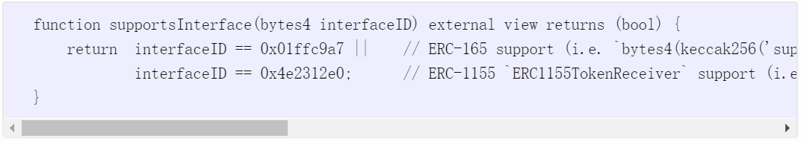
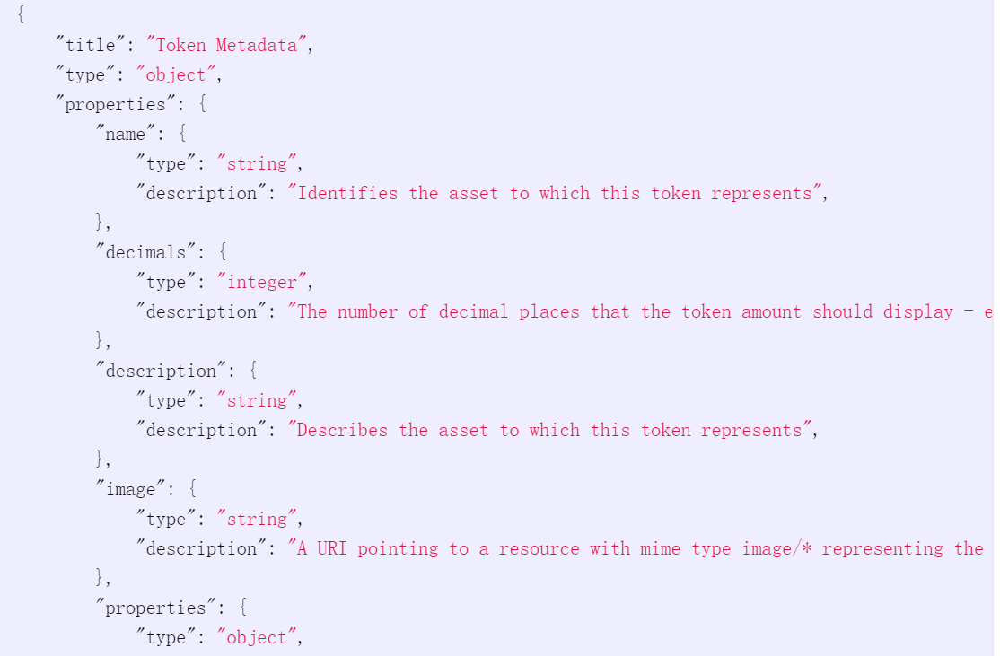
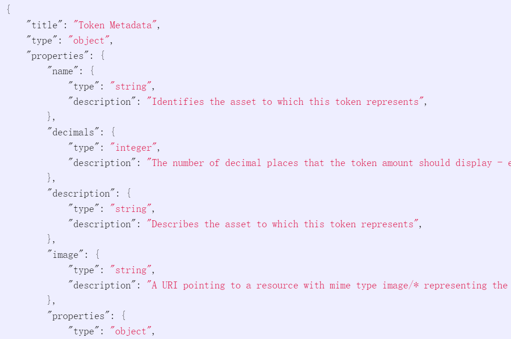
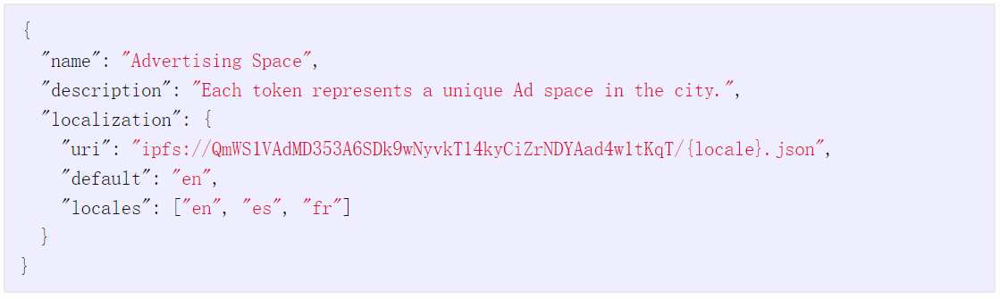

# 4.7 EIP-1155 多重通证标准

## EIP 1155: ERC-1155 Multi Token Standard（多重通证标准）

| **作者**   | [Witek Radomski](mailto:witek@enjin.io), [Andrew Cooke](mailto:ac0dem0nk3y@gmail.com), [Philippe Castonguay](mailto:pc@horizongames.net), [James Therien](mailto:james@turing-complete.com), [Eric Binet](mailto:eric@enjin.io), [Ronan Sandford](mailto:wighawag@gmail.com) |
| -------- | ---------------------------------------------------------------------------------------------------------------------------------------------------------------------------------------------------------------------------------------------------------------------------- |
| **讨论区**  | [https://github.com/ethereum/EIPs/issues/1155](https://github.com/ethereum/EIPs/issues/1155)                                                                                                                                                                                 |
| **状态**   | Final（终稿）                                                                                                                                                                                                                                                                    |
| **类型**   | Standards Track标准化跟进                                                                                                                                                                                                                                                         |
| **分类**   | ERC                                                                                                                                                                                                                                                                          |
| **创建日期** | 2018-06-17                                                                                                                                                                                                                                                                   |
| **必需基础** | [165](https://eips.ethereum.org/EIPS/eip-165)                                                                                                                                                                                                                                |

### Simple Summary 简介

A standard interface for contracts that manage multiple token types. A single deployed contract may include any combination of fungible tokens, non-fungible tokens or other configurations (e.g. semi-fungible tokens).

本协议定义了可用于管理多种通证的智能合约的接口。利用本协议只需部署一个智能合约便可管理任意种同质通证、非同质通证或其它通证（如半同质通证）的组合。

### Abstract 前言

This standard outlines a smart contract interface that can represent any number of fungible and non-fungible token types. Existing standards such as ERC-20 require deployment of separate contracts per token type. The ERC-721 standard’s token ID is a single non-fungible index and the group of these non-fungibles is deployed as a single contract with settings for the entire collection. In contrast, the ERC-1155 Multi Token Standard allows for each token ID to represent a new configurable token type, which may have its own metadata, supply and other attributes.

本协议给出了一种智能合约接口，能定义任意种类和数量的同质和非同质通证。在现有的通证标准中，ERC-20标准在使用时，需要对不同的通证种类部署不同的智能合约；ERC-721标准在使用时，需要用Token ID给每一个非同质通证的一个唯一的索引（编号），并把一组这样的非同质通证作为一个集合部署在一个智能合约中。而在ERC-1155多通证标准中，Token ID有新的用途，用它定义的通证种类，可以有自己的元数据（metadata），发行量及其它属性。

The \_id argument contained in each function’s argument set indicates a specific token or token type in a transaction.

本协议各个函数中的参数”\_id”表示交易中的某个通证或通证种类。

### Motivation动机

Tokens standards like ERC-20 and ERC-721 require a separate contract to be deployed for each token type or collection. This places a lot of redundant bytecode on the Ethereum blockchain and limits certain functionality by the nature of separating each token contract into its own permissioned address. With the rise of blockchain games and platforms like Enjin Coin, game developers may be creating thousands of token types, and a new type of token standard is needed to support them. However, ERC-1155 is not specific to games and many other applications can benefit from this flexibility.

ERC-20通证标准要求每种通证对应一个智能合约，ERC-721通证标准要求每个非同质通证集合对应一个智能合约。这两个标准定义的每个通证合约都有自己的地址，导致以太坊上承载的代码臃肿不堪，并且限制了某些功能。随着区块链游戏及平台（如Enjin）的崛起，游戏开发者很有可能需要创建成千上万种通证，这迫切需要一个全新的通证标准。ERC-1155便应运而生，它非常灵活，不仅适用于游戏，也适用于很多其它领域的应用。

New functionality is possible with this design such as transferring multiple token types at once, saving on transaction costs. Trading (escrow / atomic swaps) of multiple tokens can be built on top of this standard and it removes the need to “approve” individual token contracts separately. It is also easy to describe and mix multiple fungible or non-fungible token types in a single contract.

ERC-1155将会催生很多新的功能，比如一次性转账多种通证，从而节省转账费用。该协议也支持多种通证交易（中介交易escrow/原子互换atomic swap）并省却了以往那些交易中需要每个合约进行授权的琐碎步骤，它可以轻易地在一个合约中描述和处理多种同质通证、非同质通证或两者混合的情况。

### Specification：规范

The key words “MUST”, “MUST NOT”, “REQUIRED”, “SHALL”, “SHALL NOT”, “SHOULD”, “SHOULD NOT”, “RECOMMENDED”, “MAY”, and “OPTIONAL” in this document are to be interpreted as described in RFC 2119.

关键字“MUST”，“MUST NOT”，“REQUIRED”，“SHALL”，“SHALL NOT”，“SHOULD”，“SHOULD NOT”，“RECOMMENDED”，“MAY”，“OPTIONAL”的详细解释请参看RFC 2110

**Smart contracts implementing the ERC-1155 standard MUST implement all of the functions in the ERC1155 interface**.

**部署ERC-1155标准的智能合约必须实现ERC1155接口定义的所有函数**。

**Smart contracts implementing the ERC-1155 standard MUST implement the ERC-165 supportsInterface function and MUST return the constant value true if 0xd9b67a26 is passed through the interfaceID argument**.

**实现ERC-1155标准的智能合约必须实现ERC-165标准中的supportsInterface接口函数，并当其参数interfaceID传入值为0xd9b67a26时，返回true。**

.png>)

#### ERC-1155 Token Receiver ERC-1155通证接收者

**Smart contracts MUST implement all of the functions in the ERC1155TokenReceiver interface to accept transfers. See “Safe Transfer Rules” for further detail**.

**智能合约必须实现ERC1155TokenReceiver接口中所有定义的函数。更多细节请参看“Safe Transfer Rules”。**

**Smart contracts MUST implement the ERC-165 supportsInterface function and signify support for the ERC1155TokenReceiver interface to accept transfers. See “ERC1155TokenReceiver ERC-165 rules” for further detail**.

**智能合约必须实现ERC-165标准中的supportsInterface接口函数，并支持ERC1155TokenReceiver接口。更多细节请参看“ERC1155TokenReceiver ERC-165 rules”。**

.png>)

#### Safe Transfer Rules 安全转账规则

To be more explicit about how the standard safeTransferFrom and safeBatchTransferFrom functions MUST operate with respect to the ERC1155TokenReceiver hook functions, a list of scenarios and rules follows.

当涉及ERC1155TokenReceiver中的接口函数时，标准函数safeTransferFrom和safeBatchTransferFrom的执行方式严格遵循下列规则

Scenarios 场景

Scenario#1 : The recipient is not a contract.

**场景1**：接收者不是智能合约

**·** onERC1155Received and onERC1155BatchReceived MUST NOT be called on an EOA (Externally Owned Account).

onERC1155Received和onERC1155BatchReceived不应该被外部账户（Externally Owned Account简称EOA）调用

Scenario#2 : The transaction is not a mint/transfer of a token.

**场景2**：交易不是挖矿或转账

**·** onERC1155Received and onERC1155BatchReceived MUST NOT be called outside of a mint or transfer process.

onERC1155Received和onERC1155BatchReceived不应该在除挖矿或转账之外的其它操作中被调用。

Scenario#3 : The receiver does not implement the necessary ERC1155TokenReceiver interface function(s).

**场景3**：作为接收者的合约没有实现ERC1155TokenReceiver接口中相应的函数

**·** The transfer MUST be reverted with the one caveat below.

该笔交易必须被回滚并给出下面的警告信息。

。If the token(s) being sent are part of a hybrid implementation of another standard, that particular standard’s rules on sending to a contract MAY now be followed instead. See “Compatibility with other standards” section.

如果交易的通证是用其它合约标准实现的并且通证的实现代码中包含标准和非标准函数，则该交易可以遵循该通证的合约标准而不是ERC1155标准。详细信息请参看“Compatibility with other standards “。

Scenario#4 : The receiver implements the necessary ERC1155TokenReceiver interface function(s) but returns an unknown value.

**场景4**：接收合约实现了ERC1155TokenReceiver中相应的接口函数但返回一个未知值。

**·** The transfer MUST be reverted.

该笔交易必须被回滚。

Scenario#5 : The receiver implements the necessary ERC1155TokenReceiver interface function(s) but throws an error.

**场景5**：接收合约实现了ERC1155TokenReceiver中相应的接口函数但抛出错误。

**·** The transfer MUST be reverted.

该笔交易必须被回滚。

Scenario#6 : The receiver implements the ERC1155TokenReceiver interface and is the recipient of one and only one balance change (e.g. safeTransferFrom called).

**场景6**：接收合约实现了ERC1155TokenReceiver接口函数，并且接收者有且仅有一个账户的余额发生了变化（比如safeTransferFrom被调用）。

**·** The balances for the transfer MUST have been updated before the ERC1155TokenReceiver hook is called on a recipient contract.

转账交易中账户余额的更新必须在ERC1155TokenReceiver接口函数在接收合约处被调用之前完成。

**·** The transfer event MUST have been emitted to reflect the balance changes before the ERC1155TokenReceiver hook is called on the recipient contract.

该笔转账的事件必须在ERC1155TokenReceiver接口函数在接收合约处被调用前触发，并且事件要反映账户余额的变化。

**·** One of onERC1155Received or onERC1155BatchReceived MUST be called on the recipient contract.

onERC1155Received或onERC1155BatchReceived必须在接收合约处被调用。

**·** The onERC1155Received hook SHOULD be called on the recipient contract and its rules followed.

onERC1155Received必须在接收合约处被调用并遵循其调用规则。

。See “onERC1155Received rules” for further rules that MUST be followed.

关于调用onERC1155Received必须遵循的规则，更多细节请参看“onERC1155Received rules”。

**·** The onERC1155BatchReceived hook MAY be called on the recipient contract and its rules followed.

onERC1155BatchReceived或许（并非一定）会在接收合约处被调用，一旦被调用则必须遵循其调用规则。

。See “onERC1155BatchReceived rules” for further rules that MUST be followed.

关于调用onERC1155BatchReceived必须遵循的规则，更多细节请参看“onERC1155BatchReceived rules”。

Scenario#7 : The receiver implements the ERC1155TokenReceiver interface and is the recipient of more than one balance change (e.g. safeBatchTransferFrom called).

**场景7**：接收合约实现了ERC1155TokenReceiver接口函数，并且接收者有多个账户余额发生了变化（比如safeBatchTransferFrom被调用）。

**·** All balance transfers that are referenced in a call to an ERC1155TokenReceiver hook MUST be updated before the ERC1155TokenReceiver hook is called on the recipient contract.

转账交易中所有账户余额的更新必须在ERC1155TokenReceiver接口函数在接收合约处被调用之前完成。

**·** All transfer events MUST have been emitted to reflect current balance changes before an ERC1155TokenReceiver hook is called on the recipient contract.

所有的转账事件必须在ERC1155TokenReceiver接口函数在接收合约处被调用前触发，并且事件要反映账户的余额变化。

**·** onERC1155Received or onERC1155BatchReceived MUST be called on the recipient as many times as necessary such that every balance change for the recipient in the scenario is accounted for.

对每一个账户余额的变动，onERC1155Received或onERC1155BatchReceived都必须在接收合约处被调用。

。The return magic value for every hook call MUST be checked and acted upon as per “onERC1155Received rules” and “onERC1155BatchReceived rules”.

对每一个接口函数的返回幻术值（return magic value）必须进行检查和处理，并遵循“onERC1155Received rules”和“onERC1155BatchReceived rules”中的规则

**·** The onERC1155BatchReceived hook SHOULD be called on the recipient contract and its rules followed.

onERC1155BatchReceived必须在接收合约处被调用并遵循其调用规则。

。See “onERC1155BatchReceived rules” for further rules that MUST be followed.

关于调用onERC1155BatchReceived必须遵循的规则，更多细节请参看“onERC1155BatchReceived rules”。

**·** The onERC1155Received hook MAY be called on the recipient contract and its rules followed.

onERC1155Received或许（并非一定）会在接收合约处被调用，如调用则必须遵循其调用规则。

。See “onERC1155Received rules” for further rules that MUST be followed.

关于调用onERC1155Received必须遵循的规则，更多细节请参看“onERC1155Received rules”。

Scenario#8 : You are the creator of a contract that implements the ERC1155TokenReceiver interface and you forward the token(s) onto another address in one or both of onERC1155Received and onERC1155BatchReceived.

**场景8**：你写了一个智能合约，实现了ERC1155TokenReceiver接口函数的功能，你调用onERC1155Received或onERC1155BatchReceived或两个都调用，把该合约通证转账到另一个地址。

**·** Forwarding should be considered acceptance and then initiating a new safeTransferFrom or safeBatchTransferFrom in a new context.

该转账将被视为已经接收，并继续调用safeTransferFrom或safeBatchTransferFrom。

。The prescribed keccak256 acceptance value magic for the receiver hook being called MUST be returned after forwarding is successful.

该转账成功完成后，被调用的接收合约中的接口函数所产生的keccak256值必须被返回。

**·** The \_data argument MAY be re-purposed for the new context.

参数“\_data”可以（并非必须）被用于新的场景。

**·** If forwarding fails the transaction MAY be reverted.

如果该转账失败，则交易可以（并非必须）被回滚

。If the contract logic wishes to keep the ownership of the token(s) itself in this case it MAY do so.

在此场景下，如果合约设计者希望合约仍然保留对该通证的所有权，则通证所有权可以（并非必须）仍然为合约所有。

Scenario#9 : You are transferring tokens via a non-standard API call i.e. an implementation specific API and NOT safeTransferFrom or safeBatchTransferFrom.

**场景9**：用户通过非标准API函数转账通证。所谓的非标准API函数是指除safeTransferFrom和safeBatchTransferFrom以外的API函数。

**·** In this scenario all balance updates and events output rules are the same as if a standard transfer function had been called.

在此场景中，转账交易里所有发生的账户余额变化和触发的事件消息都必须遵循标准API被调用时所遵循的规则。

。i.e. an external viewer MUST still be able to query the balance via a standard function and it MUST be identical to the balance as determined by TransferSingle and TransferBatch events alone.

即用户仍然可以通过标准函数查询余额，并且所查询到的结果和调用TransferSingle及TransferBatch事件得到的结果一样。

**·** If the receiver is a contract the ERC1155TokenReceiver hooks still need to be called on it and the return values respected the same as if a standard transfer function had been called.

如果接收者是智能合约，ERC1155TokenReceiver接口函数仍然必须被调用，且返回值必须与调用标准函数时一样。

。However while the safeTransferFrom or safeBatchTransferFrom functions MUST revert if a receiving contract does not implement the ERC1155TokenReceiver interface, a non-standard function MAY proceed with the transfer.

当接收者是智能合约，但该合约并未实现ERC1155TokenReceiver接口函数时，safeTransferFrom或safeBatchTransferFrom一定会回滚交易。但对非标准函数而言，它可能（并非一定）会继续执行后续的操作而不回滚交易。

。See “Implementation specific transfer API rules”.

更多细节请参看“Implementation specific transfer API rules”

Rules 规则

_**safeTransferFrom rules safeTransferFrom规则**_

**·** Caller must be approved to manage the tokens being transferred out of the \_from account (see “Approval” section).

调用者必须得到授权才可以从参数“\_from”指定的账户转账通证。

**·** MUST revert if \_to is the zero address.

如果参数“\_to”设定的地址为零地址，则交易必须回滚。

**·** MUST revert if balance of holder for token \_id is lower than the \_value sent to the recipient.

对参数“token\_id”所指的通证，如果其转出账户的余额小于参数“\_value”所定义的金额，则交易必须回滚。

**·** MUST revert on any other error.

如果转账交易出现任何其它错误，交易也必须回滚。

**·** MUST emit the TransferSingle event to reflect the balance change (see “TransferSingle and TransferBatch event rules” section).

必须触发TransferSingle事件以反映账户余额的变化（请参看“TransferSingle and TransferBatch event rules”章节）

**·** After the above conditions are met, this function MUST check if \_to is a smart contract (e.g. code size > 0). If so, it MUST call onERC1155Received on \_to and act appropriately (see “onERC1155Received rules” section).

当上述条件都满足时，safeTransferFrom函数就必须检查参数“\_to”是否是一个智能合约地址（比如检查code size是否大于0），如果是，就必须在参数“\_to”所指向的智能合约上调用onERC1155Received并执行相应的操作（请参看“onERC1155Received rules”章节）。

。The \_data argument provided by the sender for the transfer MUST be passed with its contents unaltered to the onERC1155Received hook function via its \_data argument.

交易发送者必须将参数“\_data”所含的数据原原本本，不做任何改动地传递给onERC1155Received接口函数的参数“\_data”。

_**safeBatchTransferFrom rules: safeBatchTransferFrom规则**_

**·** Caller must be approved to manage all the tokens being transferred out of the \_from account (see “Approval” section).

调用者必须得到授权才可以从参数“\_from”设定的账户转账通证。

**·** MUST revert if \_to is the zero address.

如果参数“\_to”设定的地址为零地址，则交易必须回滚。

**·** MUST revert if length of \_ids is not the same as length of \_values.

如果参数“\_ids”的长度和参数“\_values”的长度不同，则交易必须回滚。

**·** MUST revert if any of the balance(s) of the holder(s) for token(s) in \_ids is lower than the respective amount(s) in \_values sent to the recipient.

对参数“\_ids”所指的通证，如果其任一转出账户的余额小于该交易所对应的参数“\_values”所定义的金额，则交易必须回滚。

**·** MUST revert on any other error.

如果转账交易出现任何其它错误，交易也必须回滚。

**·** MUST emit TransferSingle or TransferBatch event(s) such that all the balance changes are reflected (see “TransferSingle and TransferBatch event rules” section).

必须触发TransferSingle或TransferBatch事件以反映所有账户余额的变化（请参看“TransferSingle and TransferBatch event rules”章节）

**·** The balance changes and events MUST occur in the array order they were submitted (\_ids\[0]/\_values\[0] before \_ids\[1]/\_values\[1], etc).

所有账户余额的变化和事件的触发必须按其被提交的顺序发生（即\_ids\[0]/\_values\[0]在\_ids\[1]/\_values\[1]之前发生……）。

**·** After the above conditions are met, this function MUST check if \_to is a smart contract (e.g. code size > 0). If so, it MUST call onERC1155Received or onERC1155BatchReceived on \_to and act appropriately (see “onERC1155Received and onERC1155BatchReceived rules” section).

当上述条件满足时，safeBatchTransferFrom函数必须检查参数“\_to”是否是一个智能合约地址（比如检查code size是否大于0），如果是，就必须在参数“\_to”所指向的智能合约上调用onERC1155Received或onERC1155BatchReceived并执行相应的操作（请参看“onERC1155Received and onERC1155BatchReceived rules”章节）。

。The \_data argument provided by the sender for the transfer MUST be passed with its contents unaltered to the ERC1155TokenReceiver hook function(s) via their \_data argument.

交易发送者必须将参数“\_data”所含的数据原原本本，不做任何改动地传递给onERC1155Received接口函数的参数“\_data”。

_**TransferSingle and TransferBatch event rules: TransferSingle和TransferBatch规则**_

**·** TransferSingle SHOULD be used to indicate a single balance transfer has occurred between a \_from and \_to pair.

当单笔转账从参数“\_from”指定的地址发送到参数“\_to”指定的地址时，应该触发TransferSingle。

。It MAY be emitted multiple times to indicate multiple balance changes in the transaction, but note that TransferBatch is designed for this to reduce gas consumption.

若交易中出现多次转账交易，可以触发多次TransferSingle。但值得注意的是，在这种情况下可以改用TransferBatch而不用多次触发TransferSingle。TransferBatch是专为此种情形设计的，使用它能节省不少gas费用。

。The \_operator argument MUST be the address of an account/contract that is approved to make the transfer (SHOULD be msg.sender).

参数“\_operator”所指定的账户/合约地址必须被授权才能发起转账交易（必须是“msg.sender”）。

。The \_from argument MUST be the address of the holder whose balance is decreased.

参数“\_from”所指定的地址在交易发生后，余额减少。

。The \_to argument MUST be the address of the recipient whose balance is increased.

参数“\_to”所指定的地址在交易发生后，余额增加。

。The \_id argument MUST be the token type being transferred.

转账交易的通证种类由参数“\_id”所指代。

。The \_value argument MUST be the number of tokens the holder balance is decreased by and match what the recipient balance is increased by.

在转账交易中，一方余额减少而另一方余额增加。余额减少方所减少的通证数量必须等于参数“\_value”的值，并且也必须等于余额增加方所增加的通证数量。

。When minting/creating tokens, the \_from argument MUST be set to 0x0 (i.e. zero address).

当挖矿/创建通证时，参数“\_from”的值必须设为“0x0”（即零地址）。

See “Minting/creating and burning/destroying rules”.

请参看“Minting/creating and burning/destroying rules”

。When burning/destroying tokens, the \_to argument MUST be set to 0x0 (i.e. zero address).

当消除/销毁通证时，参数”\_to”的值必须设为“0x0”（即零地址）。

See “Minting/creating and burning/destroying rules”.

请参看“Minting/creating and burning/destroying rules”

**·** TransferBatch SHOULD be used to indicate multiple balance transfers have occurred between a \_from and \_to pair.

当多笔转账从参数“\_from”指定的地址发送到参数“\_to”指定的地址时，应该触发TransferBatch。

。It MAY be emitted with a single element in the list to indicate a singular balance change in the transaction, but note that TransferSingle is designed for this to reduce gas consumption.

在这种情况下也可以对这些交易中的每一笔转账触发一次TransferSingle。但值得注意的是，TransferBatch是专为此种情形设计的，使用它能节省不少gas费用。

。The \_operator argument MUST be the address of an account/contract that is approved to make the transfer (SHOULD be msg.sender).

参数“\_operator”所指定的账户/合约地址必须被授权才能发起转账交易（必须是“msg.sender”）。

。The \_from argument MUST be the address of the holder whose balance is decreased for each entry pair in \_ids and \_values.

在每一个参数对“\_ids”和“\_values”所对应的转账交易中，参数“\_from”所指定的地址在交易发生后，余额减少。

。The \_to argument MUST be the address of the recipient whose balance is increased for each entry pair in \_ids and \_values.

在每一个参数对“\_ids”和“\_values”所对应的转账交易中，参数“\_to”所指定的地址在交易发生后，余额增加。

。The \_ids array argument MUST contain the ids of the tokens being transferred.

转账交易的一系列通证中每一种通证的索引都必须对应数组参数“\_ids”中的一个值，即数组参数“\_ids”包含了所有转账通证的索引。

。The \_values array argument MUST contain the number of token to be transferred for each corresponding entry in \_ids.

转账交易的一系列通证中，每一种通证的转账数量都必须对应数组参数“\_values”中的一个值，即数组参数“\_values”包含了所有转账通证中每一种通证的转账数量。

。\_ids and \_values MUST have the same length.

参数“\_ids”和“\_values”必须长度一致。

。When minting/creating tokens, the \_from argument MUST be set to 0x0 (i.e. zero address).

当挖矿/创建通证时，参数“\_from”的值必须设为“0x0”（即零地址）。

See “Minting/creating and burning/destroying rules”.

请参看“Minting/creating and burning/destroying rules”

。When burning/destroying tokens, the \_to argument MUST be set to 0x0 (i.e. zero address).

当消除/销毁通证时，参数”\_to”的值必须设为“0x0”（即零地址）。

See “Minting/creating and burning/destroying rules”.

请参看“Minting/creating and burning/destroying rules”

**·** The total value transferred from address 0x0 minus the total value transferred to 0x0 observed via the TransferSingle and TransferBatch events MAY be used by clients and exchanges to determine the “circulating supply” for a given token ID.

给定一个通证ID，根据TransferSingle和TransferBatch事件观测到的从地址“0x0”转出的通证总量减去发送至地址“0x0”的通证总量所得到的数量可被用户及交易所视为该通证的“流通总量”。

**·** To broadcast the existence of a token ID with no initial balance, the contract SHOULD emit the TransferSingle event from 0x0 to 0x0, with the token creator as \_operator, and a \_value of 0.

给定一个通证ID，如果该通证的初始发行量为0，则其合约触发TransferSingle事件时，应从地址“0x0”发送到地址“0x0”，通证的创造者（creator）由参数“\_operator”所定义，参数“\_value”的值为0。

**·** All TransferSingle and TransferBatch events MUST be emitted to reflect all the balance changes that have occurred before any call(s) to onERC1155Received or onERC1155BatchReceived.

所有反映账户余额变化的TransferSingle和TransferBatch事件都必须在onERC1155Received或onERC1155BatchReceived被调用前触发。

。To make sure event order is correct in the case of valid re-entry (e.g. if a receiver contract forwards tokens on receipt) state balance and events balance MUST match before calling an external contract.

当发生事件重入（re-entry）时（比如一个合约在收到通证后紧接着转发通证）为了保证事件触发顺序的正确，系统的状态（？state balance）和事件（？events balance）必须匹配，然后再调用外部合约。

_**onERC1155Received rules: onERC1155Received规则**_

**·** The \_operator argument MUST be the address of an account/contract that is approved to make the transfer (SHOULD be msg.sender).

参数“\_operator”所指定的账户/合约地址必须被授权才能发起转账交易（必须是“msg.sender”）。

**·** The \_from argument MUST be the address of the holder whose balance is decreased.

参数“\_from”所指定的地址在交易发生后，余额减少。

**·** \_from MUST be 0x0 for a mint.

挖矿时参数“\_from”的值必须为“0x0”。

**·** The \_id argument MUST be the token type being transferred.

转账交易的通证种类由参数“\_id”所指代。

**·** The \_value argument MUST be the number of tokens the holder balance is decreased by and match what the recipient balance is increased by.

在转账交易中，一方余额减少而另一方余额增加。余额减少方所减少的通证数量必须等于参数“\_value”的值，并且也必须等于余额增加方所增加的通证数量。

**·** The \_data argument MUST contain the information provided by the sender for the transfer with its contents unaltered.

交易发送者必须将参数“\_data”所含的数据原原本本，不做任何改动地传递给接收者。

。i.e. it MUST pass on the unaltered \_data argument sent via the safeTransferFrom or safeBatchTransferFrom call for this transfer.

也即是onERC1155Received必须将safeTransferFrom 或safeBatchTransferFrom 函数传来的“\_data”参数不做任何改动地中转。

**·** The recipient contract MAY accept an increase of its balance by returning the acceptance magic value bytes4(keccak256("onERC1155Received(address,address,uint256,uint256,bytes)"))

接收合约如果返回了“幻术值（acceptance magic value）”bytes4(keccak256("onERC1155Received(address,address,uint256,uint256,bytes)"))其账户余额可能会增加。

。If the return value is bytes4(keccak256("onERC1155Received(address,address,uint256,uint256,bytes)")) the transfer MUST be completed or MUST revert if any other conditions are not met for success.

如果返回值是bytes4(keccak256("onERC1155Received(address,address,uint256,uint256,bytes)"))，则转账交易要么成功完成，要么因某些条件不满足而回滚。

**·** The recipient contract MAY reject an increase of its balance by calling revert.

当接收合约回滚交易后，其账户余额可能不会增加。

。If the recipient contract throws/reverts the transaction MUST be reverted.

如果接收合约抛出异常/回滚，则交易必须被回滚。

**·** If the return value is anything other than bytes4(keccak256("onERC1155Received(address,address,uint256,uint256,bytes)")) the transaction MUST be reverted.

如果返回值不是bytes4(keccak256("onERC1155Received(address,address,uint256,uint256,bytes)"))，则交易必须被回滚。

**·** onERC1155Received (and/or onERC1155BatchReceived) MAY be called multiple times in a single transaction and the following requirements must be met:

在一笔交易中，onERC1155Received（和/或onERC1155BatchReceived）可以被多次调用，但必须满足下列条件：

。All callbacks represent mutually exclusive balance changes.

所有callback函数代表的余额变化都是互斥的。

。The set of all calls to onERC1155Received and onERC1155BatchReceived describes all balance changes that occurred during the transaction in the order submitted.

所有对onERC1155Received和onERC1155BatchReceived的调用代表的余额变化依照其提交顺序依次进行。

**·** A contract MAY skip calling the onERC1155Received hook function if the transfer operation is transferring the token to itself.

如果一笔交易是合约自己给自己转账，则可以不调用onERC1155Received接口函数。

_**onERC1155BatchReceived rules: onERC1155BatchReceived规则**_

**·** The \_operator argument MUST be the address of an account/contract that is approved to make the transfer (SHOULD be msg.sender).

参数“\_operator”所指定的账户/合约地址必须被授权才能发起转账交易（必须是“msg.sender”）。

**·** The \_from argument MUST be the address of the holder whose balance is decreased.

参数“\_from”所指定的地址在交易发生后，余额减少。

。\_from MUST be 0x0 for a mint.

挖矿时参数“\_from”的值必须为“0x0”。

**·** The \_ids argument MUST be the list of tokens being transferred.

参数“\_ids”表示交易转账的通证列表。

**·** The \_values argument MUST be the list of number of tokens (matching the list and order of tokens specified in \_ids) the holder balance is decreased by and match what the recipient balance is increased by.

在转账交易中，一方余额减少而另一方余额增加。余额减少方所减少的每一种通证的数量必须等于参数“\_values”中的一个值，并且也必须等于余额增加方所增加的该种通证的数量。

**·** The \_data argument MUST contain the information provided by the sender for the transfer with its contents unaltered.

交易发送者必须将参数“\_data”所含的数据原原本本，不做任何改动地传递给接收者。

。i.e. it MUST pass on the unaltered \_data argument sent via the safeBatchTransferFrom call for this transfer.

也即是onERC1155BatchReceived必须将safeBatchTransferFrom 函数传来的“\_data”参数不做任何改动地中转。

**·** The recipient contract MAY accept an increase of its balance by returning the acceptance magic value bytes4(keccak256("onERC1155BatchReceived(address,address,uint256\[],uint256\[],bytes)"))

接收合约如果返回了“幻术值（acceptance magic value）”bytes4(keccak256("onERC1155BatchReceived(address,address,uint256\[],uint256\[],bytes)"))其账户余额可能会增加。

。If the return value is bytes4(keccak256("onERC1155BatchReceived(address,address,uint256\[],uint256\[],bytes)")) the transfer MUST be completed or MUST revert if any other conditions are not met for success.

如果返回值是bytes4(keccak256("onERC1155BatchReceived(address,address,uint256\[],uint256\[],bytes)"))，则转账交易要么成功完成，要么因某些条件不满足而回滚。

**·** The recipient contract MAY reject an increase of its balance by calling revert.

当接收合约回滚交易后，其账户余额可能不会增加。

。If the recipient contract throws/reverts the transaction MUST be reverted.

如果接收合约抛出异常/回滚，则交易必须被回滚。

**·** If the return value is anything other than bytes4(keccak256("onERC1155BatchReceived(address,address,uint256\[],uint256\[],bytes)")) the transaction MUST be reverted.

如果返回值不是bytes4(keccak256("onERC1155BatchReceived(address,address,uint256\[],uint256\[],bytes)"))，则交易必须被回滚。

**·** onERC1155BatchReceived (and/or onERC1155Received) MAY be called multiple times in a single transaction and the following requirements must be met:

在一笔交易中，onERC1155BatchReceived（和/或onERC1155Received）可以被多次调用，但必须满足下列条件：

。All callbacks represent mutually exclusive balance changes.

所有callback函数代表的余额变化都是互斥的。

。The set of all calls to onERC1155Received and onERC1155BatchReceived describes all balance changes that occurred during the transaction in the order submitted.

所有对onERC1155Received和onERC1155BatchReceived的调用代表的余额变化依照其提交顺序依次进行。

**·** A contract MAY skip calling the onERC1155BatchReceived hook function if the transfer operation is transferring the token(s) to itself.

如果一笔交易是合约自己给自己转账，则可以不调用onERC1155BatchReceived接口函数。

_**ERC1155TokenReceiver ERC-165 rules: ERC1155TokenReceiver ERC-165规则**_

**·** The implementation of the ERC-165 supportsInterface function SHOULD be as follows:

ERC-165 supportsInterface函数的实现应遵循下列规则：

**·** The implementation MAY differ from the above but:

函数实现的规则可能和上述规则不同，但是：

。It MUST return the constant value true if 0x01ffc9a7 is passed through the interfaceID argument. This signifies ERC-165 support.

当参数interfaceID的值为“0x01ffc9a7”时，函数必须返回“true”，以此体现对ERC-165的支持。

。It MUST return the constant value true if 0x4e2312e0 is passed through the interfaceID argument. This signifies ERC-1155 ERC1155TokenReceiver support.

当参数interfaceID的值为“0x4e2312e0”时，函数必须返回“true”，以此体现对ERC-1155 ERC1155TokenReceiver的支持。

。It MUST NOT consume more than 10,000 gas.

它所耗费的gas不能超过10000。

**·** This keeps it below the ERC-165 requirement of 30,000 gas, reduces the gas reserve needs and minimises possible side-effects of gas exhaustion during the call.

ERC-165 supportsInterface函数的实现所消耗的gas小于ERC-165标准规定的30000，这降低了gas的储备需求，将gas耗尽所可能引发的负面效应降到最低。

_**Implementation specific transfer API rules: 特定转账API函数的实现规则**_

**·** If an implementation specific API function is used to transfer ERC-1155 token(s) to a contract, the safeTransferFrom or safeBatchTransferFrom (as appropriate) rules MUST still be followed if the receiver implements the ERC1155TokenReceiver interface. If it does not the non-standard implementation SHOULD revert but MAY proceed.

当一个API函数是用于向一个智能合约转账ERC-1155通证时，如果该智能合约实现了ERC1155TokenReceiver接口函数，则调用safeTransferFrom或safeBatchTransferFrom所必须遵循的规则仍然必须遵循。如果该合约没有实现ERC1155TokenReceiver接口函数则交易要回滚，但在交易回滚后可以（并非一定）继续执行后续的语句。

**·** An example: 实例

1 An approved user calls a function such as function myTransferFrom(address \_from, address \_to, uint256\[] calldata \_ids, uint256\[] calldata \_values);.

经过授权的用户调用函数myTransferFrom(address \_from, address \_to, uint256\[] calldata \_ids, uint256\[] calldata \_values)时：

2 myTransferFrom updates the balances for \_from and \_to addresses for all \_ids and \_values.

myTransferFrom会将所有”\_ids”和“\_values”对应的通证种类及数量从”\_from”地址转账到“\_to”地址。

3 myTransferFrom emits TransferBatch with the details of what was transferred from address \_from to address \_to.

myTransferFrom会触发TransferBatch事件，事件会包含所转账的通证信息、发送者和接收者地址。

4 myTransferFrom checks if \_to is a contract address and determines that it is so (if not, then the transfer can be considered successful).

myTransferFrom会检查并认定“\_to”地址是否是一个智能合约地址（如果不是智能合约地址，转账可被视为成功）。

5 myTransferFrom calls onERC1155BatchReceived on \_to and it reverts or returns an unknown value (if it had returned bytes4(keccak256("onERC1155BatchReceived(address,address,uint256\[],uint256\[],bytes)")) the transfer can be considered successful).

myTransferFrom会在“\_to”指向的智能合约上调用onERC1155BatchReceived并回滚交易或返回一个未知值（如果myTransferFrom返回bytes4(keccak256("onERC1155BatchReceived(address,address,uint256\[],uint256\[],bytes)"))时，该转账交易被视为成功）。

6 At this point myTransferFrom SHOULD revert the transaction immediately as receipt of the token(s) was not explicitly accepted by the onERC1155BatchReceived function.

此时myTransferFrom应该立刻回滚交易，因为onERC1155BatchReceived函数并不显式确保通证一定被成功接收。

7 If however myTransferFrom wishes to continue it MUST call supportsInterface(0x4e2312e0) on \_to and if it returns the constant value true the transaction MUST be reverted, as it is now known to be a valid receiver and the previous acceptance step failed.

如果myTransferFrom希望继续执行后续操作，它必须在“\_to”指向的智能合约上调用supportsInterface(0x4e2312e0)。如果当它调用supportsInterface(0x4e2312e0)后，返回值是“true“则该转账交易必须被回滚，因为直到此时它才被证明是有效的接收者，而前一步的交易接收不成功。

**·** NOTE: You could have called supportsInterface(0x4e2312e0) at a previous step if you wanted to gather and act upon that information earlier, such as in a hybrid standards scenario.

注意：如果你想早点得到相关信息并进行后续操作可以在前一步就调用supportsInterface(0x4e2312e0)。

8 If the above call to supportsInterface(0x4e2312e0) on \_to reverts or returns a value other than the constant value true the myTransferFrom function MAY consider this transfer successful.

如果在“\_to“指向的智能合约调用supportsInterface(0x4e2312e0)使得交易回滚或得到的返回值不是”true“则myTransferFrom函数也可以（并非一定）视此交易为成功。

**·** NOTE: this MAY result in unrecoverable tokens if sent to an address that does not expect to receive ERC-1155 tokens.

注意：如果接收方地址无法接收ERC-1155通证，则这种操作可能会导致转账的通证永久丢失。

**·** The above example is not exhaustive but illustrates the major points (and shows that most are shared with safeTransferFrom and safeBatchTransferFrom):

上例没有详尽所有的情形，但囊括了要点（实际上这些要点很多都与safeTransferFrom和safeBatchTransferFrom一样）。

。Balances that are updated MUST have equivalent transfer events emitted.

有多少交易余额发生变化就要有多少对应的交易事件触发。

。A receiver address has to be checked if it is a contract and if so relevant ERC1155TokenReceiver hook function(s) have to be called on it.

接收者地址必须被检查是否为智能合约地址，如果是则ERC1155TokenReceiver接口函数必须在该合约处被调用。

。Balances (and events associated) that are referenced in a call to an ERC1155TokenReceiver hook MUST be updated (and emitted) before the ERC1155TokenReceiver hook is called.

账户余额的更新（以及触发的相关事件）必须在ERC1155TokenReceiver接口被调用前发生。

。The return values of the ERC1155TokenReceiver hook functions that are called MUST be respected if they are implemented.

所有被调用并且被实现的ERC1155TokenReceiver接口函数，其返回值都必须被合理设置。

。Only non-standard transfer functions MAY allow tokens to be sent to a recipient contract that does NOT implement the necessary ERC1155TokenReceiver hook functions. safeTransferFrom and safeBatchTransferFrom MUST revert in that case (unless it is a hybrid standards implementation see “Compatibility with other standards”).

仅当调用非标准函数时才允许通证被发送给一个没有实现ERC1155TokenReceiver接口函数的智能合约。在这种情况下，safeTransferFrom和safeBatchTransferFrom必须回滚交易（除非它包含标准和非标准的接口实现，详细信息请参看“Compatibility with other standards “）。

_**Minting/creating and burning/destroying rules: 挖矿/创建和消除/销毁 规则**_

**·** A mint/create operation is essentially a specialized transfer and MUST follow these rules:

挖矿/创建实质上是一种特殊的转账交易，必须遵循下列规则：

。To broadcast the existence of a token ID with no initial balance, the contract SHOULD emit the TransferSingle event from 0x0 to 0x0, with the token creator as \_operator, and a \_value of 0.

对一个初始发行量为0的通证，给定其token ID，其合约在触发TransferSingle事件时发送方地址和接收方地址都应该设为“0x0”，通证的创建者（creator）为参数“\_operator”，参数“\_value”值为0。

。The “TransferSingle and TransferBatch event rules” MUST be followed as appropriate for the mint(s) (i.e. singles or batches) however the \_from argument MUST be set to 0x0 (i.e. zero address) to flag the transfer as a mint to contract observers.

（单币种或多币种）挖矿时，“TransferSingle and TransferBatch event rules”章节中所描述的规则必须遵循，此时参数”\_from”必须设为“0x0”（即零地址）以标识此交易为挖矿。

**·** NOTE: This includes tokens that are given an initial balance in the contract. The balance of the contract MUST also be able to be determined by events alone meaning initial contract balances (for eg. in construction) MUST emit events to reflect those balances too.

注意：此规则也适用于初始发行量不为0的通证。对初始发行量不为0的通证其合约账户的余额也必须在触发的事件中反映出来，也即合约账户的初始余额（比如在构造函数中设定的余额）必须在触发的事件中反映出来。

**·** A burn/destroy operation is essentially a specialized transfer and MUST follow these rules:

消除/销毁实质上是一种特殊的转账交易，必须遵循下列规则：

。The “TransferSingle and TransferBatch event rules” MUST be followed as appropriate for the burn(s) (i.e. singles or batches) however the \_to argument MUST be set to 0x0 (i.e. zero address) to flag the transfer as a burn to contract observers.

（单币种或多币种）销毁时，“TransferSingle and TransferBatch event rules”章节中所描述的规则也必须遵循，此时参数”\_to”必须设为“0x0”（即零地址）以标识此交易为销毁。

。When burning/destroying you do not have to actually transfer to 0x0 (that is impl specific), only the \_to argument in the event MUST be set to 0x0 as above.

当消除/销毁时，你并不一定要向”0x0”地址转账（根据具体的实现而定），但必须将事件的参数“\_to”设为“0x0”。

**·** The total value transferred from address 0x0 minus the total value transferred to 0x0 observed via the TransferSingle and TransferBatch events MAY be used by clients and exchanges to determine the “circulating supply” for a given token ID.

给定一个通证ID，根据TransferSingle和TransferBatch事件观测到的从地址“0x0”转出的通证总量减去发送至地址“0x0”的通证总量所得到的数量可被用户及交易所视为该通证的“流通总量”。

**·** As mentioned above mint/create and burn/destroy operations are specialized transfers and so will likely be accomplished with custom transfer functions rather than safeTransferFrom or safeBatchTransferFrom. If so the “Implementation specific transfer API rules” section would be appropriate.

综上所述，挖矿/创建和消除/销毁通证的操作是特殊的转账交易，有可能通过除safeTransferFrom和safeBatchTransferFrom以外的用户自定义函数实现。当用户用自定义的函数实现时，必须遵循“Implementation specific transfer API rules”章节所定义的规则。

。Even in a non-safe API and/or hybrid standards case the above event rules MUST still be adhered to when minting/creating or burning/destroying.

当进行挖矿/创建和消除/销毁通证的操作时，即便用户使用的函数并非一定安全，或用户使用的函数可能既包含自定义函数也包含标准函数，其触发的挖矿/创建和消除/销毁事件也必须遵循上述规则。

**·** A contract MAY skip calling the ERC1155TokenReceiver hook function(s) if the mint operation is transferring the token(s) to itself. In all other cases the ERC1155TokenReceiver rules MUST be followed as appropriate for the implementation (i.e. safe, custom and/or hybrid).

如果挖矿操作是给自己转账通证，则合约可不用执行ERC1155TokenReceiver的接口函数。除此以外在所有的其它情形中，ERC1155TokenReceiver的规则都必须遵循。

A solidity example of the keccak256 generated constants for the various magic values (these MAY be used by implementation):

下例展示了一个Solidity实例，它基于keccak256算法产生了若干幻术值（这些幻术值可以被用在函数实现中）：

.png>)

Compatibility with other standards 与其它标准的兼容性

There have been requirements during the design discussions to have this standard be compatible with existing standards when sending to contract addresses, specifically ERC-721 at time of writing. To cater for this scenario, there is some leeway with the revert logic should a contract not implement the ERC1155TokenReceiver as per “Safe Transfer Rules” section above, specifically “Scenario#3 : The receiver does not implement the necessary ERC1155TokenReceiver interface function(s)”.

在制定本标准时，与现有标准尤其是ERC-721标准兼容一直是讨论的议题。当一个合约没有遵循ERC1155TokenReceiver的“Safe Transfer Rules”规则时，尤其是没有遵循其“场景3：接收者没有实现ERC1155TokenReceiver接口中相应的函数”的规则时，对交易回滚的处理可以有一些灵活的手法。

Hence in a hybrid ERC-1155 contract implementation an extra call MUST be made on the recipient contract and checked before any hook calls to onERC1155Received or onERC1155BatchReceived are made. Order of operation MUST therefore be:

在一个包含了非标准函数实现和标准函数实现的ERC-1155合约中，在调用任何onERC1155Received或onERC1155BatchReceived接口函数之前，还需要调用一个额外的函数，并且其调用的顺序必须遵循下列规则：

1 The implementation MUST call the function supportsInterface(0x4e2312e0) on the recipient contract, providing at least 10,000 gas.

该合约必须在接收合约处调用supportsInterface(0x4e2312e0)并且提供至少10000 gas。

2 If the function call succeeds and the return value is the constant value true the implementation proceeds as a regular ERC-1155 implementation, with the call(s) to the onERC1155Received or onERC1155BatchReceived hooks and rules associated.

如果该函数调用成功且返回值为“true”则该合约将继续执行后续动作调用onERC1155Received或onERC1155BatchReceived接口函数，与标准的ERC-1155合约一样。

3 If the function call fails or the return value is NOT the constant value true the implementation can assume the recipient contract is not an ERC1155TokenReceiver and follow its other standard’s rules for transfers.

如果该函数调用失败或返回值不是“true”则该合约可以认为接收合约不是ERC1155TokenReceiver，转而遵循其它规则。

Note that a pure implementation of a single standard is recommended rather than a hybrid solution, but an example of a hybrid ERC-1155/ERC-721 contract is linked in the references section under implementations.

注意：对一个通证标准的合约实现，建议要么都用标准函数要么都用自定义函数，把两者混在一起反而不好。但对ERC-1155/ERC-721通证标准，我们提供了一个实例，该实例代码中既包含标准函数也包含用户自定义函数。实例代码的链接在参考章节中。

An important consideration is that even if the tokens are sent with another standard’s rules the ERC-1155 transfer events MUST still be emitted. This is so the balances can still be determined via events alone as per ERC-1155 standard rules.

在设计ERC-1155通证标准时有一个重要的考虑：即使ERC-1155通证在交易过程中遵循的是其它通证标准，但ERC-1155所定义的事件必须遵循ERC-1155的规则触发。

Metadata 元数据

The URI value allows for ID substitution by clients. If the string {id} exists in any URI, clients MUST replace this with the actual token ID in hexadecimal form. This allows for a large number of tokens to use the same on-chain string by defining a URI once, for that large number of tokens.

用户可以用ID值取代URI值。如果URI中包含{id}字串，则用户必须将其用十六进制数的真实通证ID取代。这可以让大量通证共用相同的链上字符串，只需要定义一次URI即可。

**·** The string format of the substituted hexadecimal ID MUST be lowercase alphanumeric: \[0-9a-f] with no 0x prefix.

通证的ID必须仅仅包含小写字母和数字【0-9a-f】并且不带前缀“0x”。

**·** The string format of the substituted hexadecimal ID MUST be leading zero padded to 64 hex characters length if necessary.

通证的ID必须包含64个十六进制字符，若字符数没有64个，则在字符串前面全部用0填充。

Example of such a URI: https://token-cdn-domain/{id}.json would be replaced with https://token-cdn-domain/000000000000000000000000000000000000000000000000000000000004cce0.json if the client is referring to token ID 314592/0x4CCE0.

URI实例：“https://token-cdn-domain/{id}.json”中有{id}字串，它被实际的通证D（通证ID为“314592/0x4CCE0”）取代后为：

“https://token-cdn-domain/000000000000000000000000000000000000000000000000000000000004cce0.json”

Metadata Extensions 元数据扩展

The optional ERC1155Metadata\_URI extension can be identified with the (ERC-165 Standard Interface Detection)\[https://eips.ethereum.org/EIPS/eip-165].

ERC1155Metadata\_URI扩展是个可选项，它是否被使用可由ERC-165 Standard Interface Detection检测出来。

If the optional ERC1155Metadata\_URI extension is included:

如果ERC1155Metadata\_URI被使用了：

**·** The ERC-165 supportsInterface function MUST return the constant value true if 0x0e89341c is passed through the interfaceID argument.

如果ERC-165 supportsInterface接口函数的参数“interfaceID”的值为“0x0e89341c”，则其返回值必须为“true”。

**·** Changes to the URI MUST emit the URI event if the change can be expressed with an event (i.e. it isn’t dynamic/programmatic).

如果对URI值的改动可以在事件中表达（即这种改动不是通过动态/编程改变的）则这种改动必须触发URI事件。

。An implementation MAY emit the URI event during a mint operation but it is NOT mandatory.

An observer MAY fetch the metadata uri at mint time from the uri function if it was not emitted.

合约的实现代码可以在挖矿操作中触发URI事件，但这不是强制性的。

在挖矿时，如果没有事件触发，用户或许仍然可以从URI函数中获取元数据URI。

**·** The uri function SHOULD be used to retrieve values if no event was emitted.

如果没有事件触发，要获取数据就要调用URI函数。

**·** The uri function MUST return the same value as the latest event for an \_id if it was emitted.

对同一”\_id”，URI函数的返回值必须和最近一次触发的事件返回值一样。

**·** The uri function MUST NOT be used to check for the existence of a token as it is possible for an implementation to return a valid string even if the token does not exist.

URI函数不能用于检查某个通证是否存在，因为存在这种可能性：一个通证合约的实现代码对一个不存在的通证仍然返回一个有效的字符串。

.png>)

ERC-1155 Metadata URI JSON Schema ERC-1155元数据 URI JSON框架

This JSON schema is loosely based on the “ERC721 Metadata JSON Schema”, but includes optional formatting to allow for ID substitution by clients. If the string {id} exists in any JSON value, it MUST be replaced with the actual token ID, by all client software that follows this standard.

JSON框架大体上基于“ERC721 Metadata JSON Schema”，但还包括一些可选的格式让用户可以用ID进行替代。如果JSON值里面包含{id}字串，它必须用真实的通证ID替代，其规则如下：

**·** The string format of the substituted hexadecimal ID MUST be lowercase alphanumeric: \[0-9a-f] with no 0x prefix.

通证的ID必须仅仅包含小写字母和数字【0-9a-f】并且不带前缀“0x”。

**·** The string format of the substituted hexadecimal ID MUST be leading zero padded to 64 hex characters length if necessary.

通证的ID必须包含64个十六进制字符，若字符数没有64个，则在字符串前面全部用0填充。

An example of an ERC-1155 Metadata JSON file follows. The properties array proposes some SUGGESTED formatting for token-specific display properties and metadata.

下例为一个ERC-1155 Metadata JSON文件。其属性数组罗列了一些建议使用的格式，这些格式定义了通证的显示属性和元数据。

.png>)

Localization 本地化

Metadata localization should be standardized to increase presentation uniformity across all languages. As such, a simple overlay method is proposed to enable localization. If the metadata JSON file contains a localization attribute, its content MAY be used to provide localized values for fields that need it. The localization attribute should be a sub-object with three attributes: uri, default and locales. If the string {locale} exists in any URI, it MUST be replaced with the chosen locale by all client software.

元数据的本地化应该有一套标准的做法，这样才能使得不管用什么语言，它的表述方式都是统一的。因此，有人提出了一种简单的覆盖方式。如果metadata JSON文件包含一项“本地化”属性，则这个属性的内容则可能提供了某些应用需要的本地化值。该“本地化”属性应该是一个子对象（sub-object）并且包含三个特性：uri，default（缺省值）和locales（属地）。如果URI中存在{locale}字串，则它必须用真实的属地替代。

JSON Schema JSON框架

Localized Sample 本地化实例

**Base URI: 原始URI**

es.json: 西班牙语的 es.json

.png>)

fr.json: 法语的fr.json

.png>)

Approval 授权

The function setApprovalForAll allows an operator to manage one’s entire set of tokens on behalf of the approver. To permit approval of a subset of token IDs, an interface such as ERC-1761 Scoped Approval Interface is suggested. The counterpart isApprovedForAll provides introspection into any status set by setApprovalForAll.

setApprovalForAll函数让授权者授权其他操作者管理其所有的通证。如果授权者只希望授权部分通证的管理权限则可以使用ERC-1761 Scoped Approval接口。如果想查看setApprovalForAll函数设置的授权状态可以调用isApprovedForAll函数进行查询。

An owner SHOULD be assumed to always be able to operate on their own tokens regardless of approval status, so should SHOULD NOT have to call setApprovalForAll to approve themselves as an operator before they can operate on them.

无论通证是否被授权给他人管理，通证的所有者永远都能管理自己的通证。因此通证的所有者无需调用setApprovalForAll给自己授权就可直接管理通证。

**Rationale 基本原理**

Metadata Choices 元数据的选择

The symbol function (found in the ERC-20 and ERC-721 standards) was not included as we do not believe this is a globally useful piece of data to identify a generic virtual item / asset and are also prone to collisions. Short-hand symbols are used in tickers and currency trading, but they aren’t as useful outside of that space.

符号（在ERC-20和ERC-721标准中都有）这一项没有被包括在内，因为我们不认为该项数据对标识一个虚拟物品/资产有什么意义并认为它还容易造成冲突。符号多用在标识和数字货币交易中，除此以外它没什么用处。

The name function (for human-readable asset names, on-chain) was removed from the standard to allow the Metadata JSON to be the definitive asset name and reduce duplication of data. This also allows localization for names, which would otherwise be prohibitively expensive if each language string was stored on-chain, not to mention bloating the standard interface. While this decision may add a small burden on implementers to host a JSON file containing metadata, we believe any serious implementation of ERC-1155 will already utilize JSON Metadata.

名称（人类易读的资产命名，属于链上数据）也没有被包含在内，这样做是为了使Metadata JSON成为准确定义资产名称的数据，减少重复的数据，这也可以使命名本地化。否则对每一种语言都要用一个字符串命名并且存到链上，这将会使耗费大得惊人，也会使合约标准的接口臃肿不堪。尽管这样的做法使得合约编写者必须用一个JSON文件存储元数据（metadata），看上去增加了一些负担，但我们认为任何一个严肃的ERC-1155合约编写者都会用JSON Metadata（译者注：作者的意思是即便他们不这样要求，严肃的代码编写者也会提供JSON Metadata）。

Upgrades 升级

The requirement to emit TransferSingle or TransferBatch on balance change implies that a valid implementation of ERC-1155 redeploying to a new contract address MUST emit events from the new contract address to replicate the deprecated contract final state. It is valid to only emit a minimal number of events to reflect only the final balance and omit all the transactions that led to that state. The event emit requirement is to ensure that the current state of the contract can always be traced only through events. To alleviate the need to emit events when changing contract address, consider using the proxy pattern, such as described in ERC-1538. This will also have the added benefit of providing a stable contract address for users.

当发生账户余额变化时，必须触发TransferSingle或TransferBatch。这意味着一个ERC-1155合约的实现代码被部署到一个新的合约地址时必须从新的合约地址触发事件，将老合约的最后状态再次显示。这时只要触发最少数量的事件以反映老合约的最后状态即可，而老合约在变为最后状态之前进行了哪些交易可以忽略不计。对事件触发设计的这个规则是为了保证当前合约的状态永远可以通过过往事件进行追踪。当改变合约地址时，为了减少不必要的事件触发，可以考虑使用代理模式，比如ERC-1538所定义的那样。这样做也是为了能给用户提供一个稳定的合约地址。

Design decision: Supporting non-batch 设计决策：支持非批量交易

The standard supports safeTransferFrom and onERC1155Received functions because they are significantly cheaper for single token-type transfers, which is arguably a common use case.

本标准支持safeTransferFrom和onERC1155Received函数，因为对单一通证的交易调用它们所需的耗费少很多，这应该好理解。

Design decision: Safe transfers only 设计决策：转账必须安全

The standard only supports safe-style transfers, making it possible for receiver contracts to depend on onERC1155Received or onERC1155BatchReceived function to be always called at the end of a transfer.

本标准只支持安全的转账，使接收合约在收到转账后，onERC1155Received或onERC1155BatchReceived函数必须被调用。

Guaranteed log trace 日志追踪有保障

As the Ethereum ecosystem continues to grow, many dapps are relying on traditional databases and explorer API services to retrieve and categorize data. The ERC-1155 standard guarantees that event logs emitted by the smart contract will provide enough data to create an accurate record of all current token balances. A database or explorer may listen to events and be able to provide indexed and categorized searches of every ERC-1155 token in the contract.

随着以太坊生态系统的持续发展，很多DAPP依赖传统的数据库和浏览器提供的API服务获取和分类数据。ERC-1155标准保证其智能合约所触发的事件日志能提供足够多的数据，准确地记录所有通证账户余额的变化。对合约中每一个ERC-1155通证，可以用数据库或浏览器监听所触发的事件，也可以提供经过索引和分类的搜索结果。

Approval 授权

The function setApprovalForAll allows an operator to manage one’s entire set of tokens on behalf of the approver. It enables frictionless interaction with exchange and trade contracts.

setApprovalForAll函数让授权者授权其他操作者管理其所有的通证。它使得交易所交易和合约交易之间完全无障碍。

Restricting approval to a certain set of token IDs, quantities or other rules MAY be done with an additional interface or an external contract. The rationale is to keep the ERC-1155 standard as generic as possible for all use-cases without imposing a specific approval scheme on implementations that may not need it. Standard token approval interfaces can be used, such as the suggested ERC-1761 Scoped Approval Interface which is compatible with ERC-1155.

如果授权者只希望授权部分通证，通证的部分数量或其它权限的管理则可以另外使用一个接口或外部合约来处理。这样做的基本原理是保证ERC-1155标准尽量通用，在任何情况下都无需在具体的代码实现中编写特殊的授权机制。而且这些具体的代码实现可能根本就不需要这种特殊的授权机制。如果实在需要这种授权可以使用标准的通证授权接口比如ERC-1761 Scoped Approval接口，它和ERC-1155协议是兼容的。

Usage 用法

This standard can be used to represent multiple token types for an entire domain. Both fungible and non-fungible tokens can be stored in the same smart-contract.

本标准可用于定义一个领域内的多种通证类型。同质通证和非同质通证可以共存于同一个智能合约内。

Batch Transfers 批量转账

The safeBatchTransferFrom function allows for batch transfers of multiple token IDs and values. The design of ERC-1155 makes batch transfers possible without the need for a wrapper contract, as with existing token standards. This reduces gas costs when more than one token type is included in a batch transfer, as compared to single transfers with multiple transactions.

safeBatchTransferFrom函数可以同时转账各种数量的各种通证。ERC-1155的设计支持批量转账而无需另外的打包合约（wrapper contract），而现有的其它通证标准要进行批量转账则需要另外的打包合约（wrapper contract）。当系统需要转账多种通证时，传统的做法不得不一笔笔的转账，而ERC-1155的设计使得转账多种通证所需的gas耗费大为降低，。

Another advantage of standardized batch transfers is the ability for a smart contract to respond to the batch transfer in a single operation using onERC1155BatchReceived.

这样设计的另一个好处是ERC-1155智能合约可以用onERC1155BatchReceived这一个操作处理批量转账。

It is RECOMMENDED that clients and wallets sort the token IDs and associated values (in ascending order) when posting a batch transfer, as some ERC-1155 implementations offer significant gas cost savings when IDs are sorted. See Horizon Games - Multi-Token Standard “packed balance” implementation for an example of this.

建议用户和钱包项目方要进行批量转账时，对待转账的所有token ID和每个ID对应的通证数量进行排序（升序排列）。因为ERC-1155标准对进行了排序的通证进行批量转账时会显著降低gas耗费。详细信息请参看“Horizon Games - Multi-Token Standard”章节中的“打包余额（packed balance）”实例。

Batch Balance 批量账户余额

The balanceOfBatch function allows clients to retrieve balances of multiple owners and token IDs with a single call.

balanceOfBatch函数让用户仅仅只需调用这个函数便能获取多个通证所有者及其所持有的通证的余额信息。

Enumerating from events 事件枚举

In order to keep storage requirements light for contracts implementing ERC-1155, enumeration (discovering the IDs and values of tokens) must be done using event logs. It is RECOMMENDED that clients such as exchanges and blockchain explorers maintain a local database containing the token ID, Supply, and URI at the minimum. This can be built from each TransferSingle, TransferBatch, and URI event, starting from the block the smart contract was deployed until the latest block.

为了让ERC-1155合约的实现尽量少地占用存储，枚举（枚举所有的通证ID及每个通证对应的数量）必须用事件日志实现。建议交易所和区块链浏览器项目方在本地保留一个数据库至少记录token ID，供应量和URI这三项信息。数据库的数据可以从TransferSingle，TransferBatch和URI事件中提取，记录的时间可以从智能合约部署的那一刻算起一直记录到最新产生的区块。

ERC-1155 contracts must therefore carefully emit TransferSingle or TransferBatch events in any instance where tokens are created, minted, transferred or destroyed.

ERC-1155合约的编写者在通证被创建，挖矿，交易和销毁时必须小心谨慎地触发TransferSingle和TransferBatch事件。

Non-Fungible Tokens 非同质通证

The following strategies are examples of how you MAY mix fungible and non-fungible tokens together in the same contract. The standard does NOT mandate how an implementation must do this.

下列示范展示了如何在一个智能合约中既定义同质通证也定义非同质通证，但ERC-1155标准并不强制要求编写者必须按该示范编写。

Split ID bits 切分ID的位

The top 128 bits of the uint256 \_id parameter in any ERC-1155 function MAY represent the base token ID, while the bottom 128 bits MAY represent the index of the non-fungible to make it unique.

在任何一个ERC-1155函数中，参数”uint256 \_id”的前128位都可以（并非一定）被用来定义token ID。而余下的128位可以（并非一定）被用来定义非同质通证的唯一索引。

Non-fungible tokens can be interacted with using an index based accessor into the contract/token data set. Therefore to access a particular token set within a mixed data contract and a particular non-fungible within that set, \_id could be passed as \<uint128: base token id>\<uint128: index of non-fungible>.

非同质通证可以用带索引的变量访问。如果一个合约的通证集合中有某个非同质通证，用户可以用”\_id”访问该非同质通证，此时”\_id”值的构成为\<uint128:非同质通证ID>\<uint128:非同质通证的索引>。

To identify a non-fungible set/category as a whole (or a fungible) you COULD just pass in the base id via the \_id argument as \<uint128: base token id>\<uint128: zero>. If your implementation uses this technique this naturally means the index of a non-fungible SHOULD be 1-based.

为了标识一个非同质通证集合/类别，你可以将参数“\_id”的值设为\<uint128:非同质通证ID>\<uint128:0>。如果合约的代码实现使用了这个技巧，则意味着一个非同质通证的索引基于“1”（1-based）。

Inside the contract code the two pieces of data needed to access the individual non-fungible can be extracted with uint128(\~0) and the same mask shifted by 128.

在合约中，访问一个非同质通证需要两部分数据（译者注：即高128位数据和低128位数据），这两部分数据可以分别用uint128(\~0)和128位移位运算获得。

.png>)

Note that 128 is an arbitrary number, an implementation MAY choose how they would like this split to occur as suitable for their use case. An observer of the contract would simply see events showing balance transfers and mints happening and MAY track the balances using that information alone. For an observer to be able to determine type (non-fungible or fungible) from an ID alone they would have to know the split ID bits format on a implementation by implementation basis.

注意：128不是个固定值，合约编写者可以自己选择合适的方式来划分这256位的用途。用户只需要能从合约触发的事件中看到转账交易和挖矿发生就行了，当然用户也可以通过这些事件追踪余额的变化。如果用户希望从ID中判断转账的通证类型（同质通证或非同质通证）则需要研究合约的实现代码是如何划分ID数位的用途的。

The ERC-1155 Reference Implementation is an example of the split ID bits strategy.

ERC-1155参考案例展示了如何划分ID的数位用途。

Natural Non-Fungible tokens 自然的非同质通证

Another simple way to represent non-fungibles is to allow a maximum value of 1 for each non-fungible token. This would naturally mirror the real world, where unique items have a quantity of 1 and fungible items have a quantity greater than 1.

有一个简单表示非同质通证的方法：对每一个非同质通证尽量用“1”来定义。这是对真实世界最自然的映射。在真实世界中每一个唯一的事物有且仅有一个，而每一种同质通证则有多个。

References 参考

Standards 标准

ERC-721 Non-Fungible Token Standard

ERC-165 Standard Interface Detection

ERC-1538 Transparent Contract Standard

JSON Schema

RFC 2119 Key words for use in RFCs to Indicate Requirement Levels

Implementations

ERC-1155 Reference Implementation

Horizon Games - Multi-Token Standard

Enjin Coin (GitHub)

The Sandbox - Dual ERC-1155/721 Contract

Articles & Discussions

Github - Original Discussion Thread

ERC-1155 - The Crypto Item Standard

Here Be Dragons - Going Beyond ERC-20 and ERC-721 To Reduce Gas Cost by \~80%

Blockonomi - Ethereum ERC-1155 Token Perfect for Online Games, Possibly More

Beyond Gaming - Exploring the Utility of ERC-1155 Token Standard!

ERC-1155: A new standard for The Sandbox

Copyright

Copyright and related rights waived via CC0.

## 启发

1. 除了为多个通证提供标准接口外，ERC-1155还带来其它重要好处：
   * 通过将多个复杂的操作打包到一个交易中，它将使交易更便宜；
   * 它能组合多个通证并启用原子交换（勿需第三方）；
   * 它将大大提高以太坊网络的效率；
   * ERC-1155允许开发人员将一组通证的代码存储在一个智能合约中，并在需要时被其他智能合约所调用。 简而言之，它可被充分地重复利用，而不是像现在其它标准下的不断复制代码部署新合约。 可想而知，这将大大减少以太坊的存储空间和算力。\\
2. 因为智能合约能够保证收益无法被侵犯，知识产权、版权等概念，可能在区块链领域将无存在的必要。

## 最后

请多关注：[https://nonfungible.com/](https://nonfungible.com)
