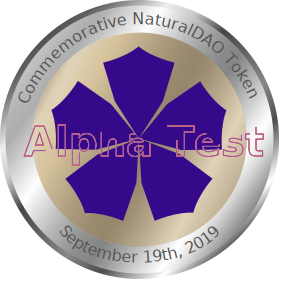

# 4.9 挽救ERC-721纰漏的ERC-2569

在介绍ERC-721的时候，我发现整个行业的应用从一开始就把NFT产品的图片直接链到了链下！

这毫无疑问是一个巨大的错误！

_**在前面对ERC-721介绍时，我已经说过：问题在于 其标准中的tokenURI 可指向一个JSON 文件，于是开发者就把NFT产品的图片或视频通过 URL 记录到这个JSON 文件中——这也就是说，这些所谓的“非同质化通证”的图片或视频大多保存在私有服务器上。用智能合约玩出了一个互联网产品，还硬说是NFT！**_

#### 为了解决这个巨大的缺陷，我和道易程开发者一起，于2019年进行了摸索，并最终决定采用SVG格式图片链上存储的方式解决部分需求，并于2020年初推出对应的接口标准[ERC-2569](https://eips.ethereum.org/EIPS/eip-2569)。

这是我们道易程团队2019年的技术成果，但它仍然具有很大的改进空间。



## ERC-2569能做什么？

先看看我们通过ERC-2569发行的第一个真正的ERC721链上NFT：

<figure><figcaption>
人类首个真正的NFT
</figcaption></figure>

更神奇的是，由于SVG是用XML语言的可读代码写出来的，事实上它的应用于图片并不局限于图片。譬如论文也是可以通过SVG保存到链上的！

以下内容我已经永久存储到了以太坊链上。你可以用钱包里的浏览器访问这个地址，来阅读全文：[https://deme.app/full#1](https://deme.app/full#1)

**它有什么创新？**

与它有关的ERC721通证、图片、文字信息都在一个以太坊智能合约里！它很可能是迄今为止，第一个也是唯一一个真正的非同质性物品区块链资产。谜恋猫（Cryptokitties）因为猫的图片都在链下，算不上真正的区块链资产。

自然道纪念币图片的格式为可缩放矢量图形（Scalable Vector Graphics,SVG）。官方（W3C）的解释为：SVG is a language for describing two-dimensional graphics in XML \[[XML10](https://www.w3.org/TR/SVGMobile/refs.html#ref-XML10), [XML11](https://www.w3.org/TR/SVGMobile/refs.html#ref-XML11)]. SVG allows for three types of graphic objects: vector graphic shapes (e.g., paths consisting of straight lines and curves), multimedia (such as raster images, video, and audio), and text. Graphical objects can be grouped, styled, transformed and composited into previously rendered objects.

之所以采用SVG图片，核心原因是因为它是由XML语言代码构成的，而代码可以直接保存到智能合约里。

> Special tags of Commemorative NaturalDAO Token:
>
> \<description>This ia a medal of honor awards from Alpha Test of NaturalDAO.\</description>\
> \<honoree class="thonoree">Alpha Tester\</honoree>\
> \<ARTIST>Tung Sau Chun Queena\</ARTIST>

你可以通过W3C了解它的技术规格：[Scalable Vector Graphics (SVG) Tiny 1.2 Specification](https://www.w3.org/TR/SVGMobile/)。

另一个和SVG类似的技术是Canvas。两者的简单对比（中文）：[https://www.w3school.com.cn/html5/html\_5\_canvas\_vs\_svg.asp](https://www.w3school.com.cn/html5/html\_5\_canvas\_vs\_svg.asp)。

Canvas甚至有了自己的游戏引擎：[playcanvas](https://playcanvas.com/)。

* #### 启发

那么它们对区块链的数据存储有什么启发？

1. 图片甚至整个游戏都应该以可读代码形式保存到智能合约里，可以很好地保护设计者和所有者的权利，保障通证或游戏的透明性。\
   因为从比特币开始，区块链通证就已经是匿名的了——没有人确切地知道一个某个地址属于谁。而当中本聪丢失私钥之后，现在全世界都没有办法确认James Bilal Khalid Caan是不是中本聪——所以我个人并不认为区块链还有传统的隐私和版权保护概念，因为一切都与人的身份无关，直接用私钥控制就好了。而私钥永远都不应该被暴露！\
   而更重要的问题，就是数据的所有权、使用权、收益权和透明性。\
   如果把图片转换成SVG，即可以将其所有权、使用权、收益权用文字形式永久保存到智能合约里，通过智能合约的透明性，图片的所有权、使用权、收益权就完全不存在可争议的了。而同时，其可读性自然就更能够得到保障。\
   我采用SVG而不是Canvas设计纪念币的原因是它的源代码有更好的易用性（accessibility，包括可访问、可读、可检索和可衍生）。而易用性与智能合约的公开透明相结合，就能更好地保证项目的可靠性，也使得大家能够更好地开放协作等等。
2. 解决区块链数据存储需求，不再需要IPFS来存储数据。\
   SVG和Canvas都可以存储在智能合约里，和IPFS存储相比，它的好处为：
   1. 不需要存储证明\
      IPFS需要存储证明，每时每刻都要能证明存储的数据还完好无损，其难度可想而知。但我们知道，以太坊里面的交易数据，因为有共识机制和众多存储节点提供保障，就根本不需要存储证明。
   2. 拓展以太坊的应用范畴\
      通过分片技术创新即可让以太坊承担存储。我们可以通过技术手段将不同的任务分配给不同的分片，譬如分片A专门存储图片（SVG和Canvas），分片B专门存储视频。不同种类的分片的每字节存储手续费不尽相同。\
      如果深入探讨，我们应该能够完善这一存储技术。
   3. 通过技术拓展，采用更高效的手段，丰富其应用方法\
      譬如它们可内置智能合约。又譬如SVG和Canvas都具有可交互性，那么我们通过技术拓展，可以让它们能够达到智能合约可交互性。这毫无疑问能大大拓展它们的应用价值。点击上面的图片，你可以体验到我做的简单的交互效果。\
      另外XML也有很丰富的用途，如可以支持多语言自动切换（甚至可以为整个区块链领域开发出统一的多语言库），并且它本身还具有其它可拓展性。
3. 标准化应用\
   以太坊的分布式存储是重复率超高的，资源浪费严重，但它是可以通过新的技术改进，亦即新的技术规范，而解决好的。而SVG能让图片以素材形式保存，而文字内容可以一律用另一个合约保存。这样不光对应的智能合约，其图片素材的重复使用率也会得到极大的提升——譬如我们可以定义某种区块链标准勋章，全世界都能自由使用它。\
   可想而知，我讲的这些不单适用于虚拟的NFT资产，这种模式也可以推广到工业设计领域。
4. 它们是可衍生数据\
   SVG 支持用 CSS 样式表将图形内容和图形样式分离。如果我们把CSS文件置于链下，则最终呈现的作品变得可以任意衍生。\
   同样地，使用Javascript，也能使得HTML5 Canvas游戏里的道具，随意个性化。\
   当然，衍生也可以利用智能合约在以太坊链上进行。
5. 我们是不是可以构建出一个自组织图片系统（self-organized Picture System），或者叫混沌图片系统（Chaos Picture System）？因为这样的衍生通过简单的规则，配合图灵完备的智能合约对feedback的吸纳，它自身就是有创造力的，通过市场机制它也可能自然地发生evolution，世间万物的演化规律同样适用于它。

