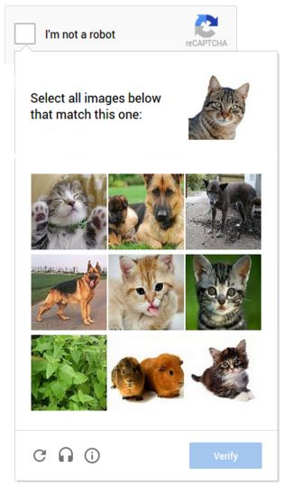

# 6.4 开源的优势与必要

开源也已经成为当今软件开发的主流模式，内容的开源和硬件的开源（如树莓派Raspberry）也已经如火如荼地发展起来。相信未来开源摸索会渗入到各行各业中。开放源代码有很多优越于非开源的特性。它非常适合于去中心化协作。

## 践行区块链价值观，服务全人类

本章开篇列出的“开放源代码应用实例”里的哪一个实例没有惠及全人类？

这是开源的最重要的目的！开源最重要的目的是汇集更广泛的智慧，并最广泛地惠及全世界的人和组织。

和Windows相比，26年来一直免费的Linux系统通过开源，不但惠及全人类，而且从桌面到服务器到手机到树莓派，无论这个世界在怎么变化，它都一路畅通无阻。这是因为开源的无私，导致它对于人心有更大的召唤力，可以得到更多的人的协助，成功地突破了距离、国界、价值观的限制，最大程度地凝聚了人们的智慧！形成鲜明对比的是，Windows已经止步于手机和树莓派领域，所以，无论是从智慧的凝聚这方面来讲，还是说到软件的未来远景，Windows和Linux显然不可同日而语。

今天有很多公司，IBM、Microsoft、Samsung……都在抢占区块链高地。但是最伟大的区块链项目，早就不在它们能够企及的范围了。这个项目的名称是：

Ethereum。

## 践行良好的自我治理

1999年Lawrence Lessig教授出版专著《Code》，提出Code is law。其思想发端，据教授本人介绍，是在伟大的1989年。直到今天，在中国接触过Code is law这个概念的人都还很少。可想而知，在1999年的很多人眼里，恐怕Lawrence Lessig教授当时跟个疯子似的。

简单说吧：网络世界完全是由代码构成的，代码也一代比一代智能，越来越多的事实也证明了代码比人更可靠，那么我们为什么不能让代码本身成为法律呢？你知道吗，在互联网的早期，我们的期待和网络本身的承诺都是要构建一个自由的世界，但我们没能让代码成为法律，因此迄今我们还在这种期望和承诺里挣扎！

代码越来越比人可靠，机器掌握学习能力和自编程能力的那一天的到来，也不会太遥远——那时候的代码将是由已经比所有棋类游戏里战胜了人类的AI更聪明的AI来编写，其可靠性将远远超过人类！所以让代码成为法律，恐怕也是难以抵挡的潮流和必然归宿。

要想达到Code is law，那么很自然地，我们就必须开放源代码。

2011年12月21日国内最大的开发者社区CSDN.NET的用户密码遭到黑客泄漏，证实他们用明文保存用户密码。接下来一周，巨大规模的用户密码泄漏事件纷至沓来，全国网民的嘴都一直没来得及合上。

按照当时的网络情况，全国百分之八九十的网民都是受害者。

百度下“不堪回首：细数2014年最严重的数据泄露事故”即可见国外同类事件一样屡见不鲜。

最让人纠结的是，这些泄漏了用户密码的网站，毫发无伤，完全不承担任何责任。而此类事件，年年都层出不穷！

因为未开放源代码，我们无法知道数据泄露的真实原因！对此也就完全束手无策。

但因为开源软件里也一直存在各种各样的bug，虽然总体情况越来越好，Code is law还是一直无法得到很好的实践。不过到了区块链时代，我们突然发现这个划时代的技术能够我们可以开始践行更合理的“Smart Contract is law”：

* 智能合约的代码已经采用公开透明的原则。
* 智能合约能够抗干扰地（无私地）直接决定我们的代币按照既定协议条款处置。
* 在开源的前提下，智能合约可以做到公平公正。
* 配合数据的公开透明，智能合约的公信力能够碾压一切其它解决方案。

回想一下，智能合约标准都是用代码写就的，那么你就不难理解，Code is law 还有一层积极的意义，就是区块链的开发，往往是从代码找到基础和方向！

## 弹性的起步

很多项目在初期，其实只有一个idea，需要有试错的机会，需要有多方面摸索的机会，需要有一个慢慢丰满羽翼的机会。区块链现在还在起步阶段，你还有充分的时间试错（因为大家都在摸索阶段），而开放源代码恰恰能配合这样的试错机会。

## 极好的宣传

我们来看看Ethereum：

* Ethereum由一家非盈利性基金管理，它本身是一个非盈利项目。
* Ethereum C++ client是一个自由软件，供全球自由使用。
* Ethereum会持续升级并修复各种bug，不用你担心项目的基础工作；
* 从前面我们讨论的EIPs，可以看出：全球很多专业人员和用户都一直在为Ethereum作贡献。第三方贡献的标准或者功能扩展越来越丰富。
* Ethereum有一个越来越庞大、越来越团结的社区，未来一片光明。

就像雷锋做了好事，几代人一直在讴歌他，开放源代码软件能够让全球用户收益，因此开源就是在给自己做广告。

## 吸引人才

开放源代码之后，各种人才也会接踵而至——因为他可能会对项目一见钟情，而且所有的开源项目都欢迎新成员的加入。人多力量大。

代码开源之后，任何人都可以迅速了解背后的结构与基础，可以直接下手，可以更好地与现有团队成员协作，或者通过fork机制贡献其成果——如果他觉得自己有新想法，他还可以直接创建分支。即使他另起炉灶，毕竟你启发了他或者刺激了他，这也算你做了贡献，而并不是说有了竞争你就失败了。

譬如，比特币核心钱包是整个比特币技术应用链里的核心基础。现在在开发比特币核心钱包的就有好几个团队，其中影响比较大的有Bitcoin Core、Bitcoin Classic、Bitcoin Unlimited和Bitcoin XT。用户可以自由选择他们使用哪一个钱包。特别是在比特币面临扩容而需要区块链分叉的时候，不同的钱包开始蕴含不同的技术解决方案，这时候的用户的自由选择就是比特币去中心化的最好体现。否则如果根本就没有选择，那么所谓社区共识就是一句空话，或者一场没完没了的全球争论！

当然，要尽可能多地吸引人，你就应该把项目托管到一个程序员多、开源项目也多的平台，这是大家首选github.com托管代码的原因。

一些人只知道stackoverflow.com，reddit.com，codeproject.com。这些的确也是交流的好地方，但是在自由的开发协作、项目开源、代码学习等等方面，项目托管网站才是最好的选择！

知道以太坊在这些项目托管网站现在有多少个协作者吗？

这个网站可以查询到：[CoinGecko （http://coingecko.com）](http://coingecko.com)

2018年5月9日，我看到有5544个Fork，235个贡献者，过去四周递交了30份修改工作。

## 组合式的工业协作模式

2001年Joomla的前身Mambo创建的时候，只是一个小软件，本身还特别简单。今天如果从功能上讲，它甚至更小了——你能相信吗，一个小软件发展了17年后，功能变得更少、让人觉得更小了！

这是真的。四年前Joomla就开始做减法，逐步剥离掉核心里面的第三方插件以及做得更好的新闻联播（新闻聚合）、旗帜广告、联系我们、站内搜索、智能搜索、重定向、站内短信等功能组件。这是因为Joomla从一开始就把自己定位成了系统，通过开放模式，很快它也的确就成为了系统。它成功实现这一目标的手段，是从一开始就不仅通过源代码，还通过技术文档（documentation）把自己完全开放出来。而作为系统，有了很多第三方开发的功能扩展（extension），它本身就不再需要那么多功能，它要做好的更多的是为第三方开发的功能扩展提供最好的底层支撑。

最多的时候，整个社区贡献了2.5万套开源扩展（extension），从商城到学习管理到租房，几乎什么类型都有。一个小小的核心，带动了这2.5万套扩展的开源，想想这是多么激动人心的事情！

Joomla还是一个小软件吗？

这和我们手机里的Android也是一样的：Android本身能打电话能发短信能拍照就可以了。它只要把蓝牙、GPS、摄像头等等基础准备好，用户使用第三方开发的美图秀秀、Pokémon Go、微信、大众点评、京东商城、饿了么……大家就都可以愉快地享受低头族的美好时光了！

请记住：开源是能让你的区块链项目，从一个项目变成一个社区，从一个软件变成一个平台，从一个组织变成一个小世界的最可靠甚至是今天唯一的手段。同一类项目，如果你开源你的竞争对手闭源，你想想你十年后，他还可以与你平起平坐吗？

## 提高效率，降低重复性工作

优秀的开源论坛程序数量目前已经很庞大了：phpBB、Simple Machines Forum、bbPress、Discourse、Vanilla、miniBB、YetAnotherForum、IceBB、YaBB、MyBB、DeluxeBB、PunBB、FluxBB、Phorum、UseBB、XMB……

知道phpBB最早是什么时候推出的吗？

2000年。

一个论坛程序被一个团队不间断地开发了18年，就算是天才，也得结合最前沿的区块链技术才能挑战他们！

最最典型的还有TinyMCE编辑器、Bootstrap前端框架、Google的reCaptcha验证码。如果你没有天才的想法，最好不要去做同类的开发。

Google的reCaptcha验证码也许你用过吧：

reCaptcha并非一个简单的项目，它是全自动区分计算机和人类的公开图灵测试——这个概念已经如雷贯耳了。现在它有三个分支技术。有图有真相：

| 
reCAPTCHA

 | 
SQUIGL-PIX（自动识别你是不是人）

 |
| ------------------------------------------------------------------ | ---------------------------------------------------------------------------------------------------------- |

ESP-PIX（通过做题判断你是不是人）

介绍下看上去不那么高科技的reCAPTCHA吧：

美国宾夕法尼亚州匹兹堡市的CMU研究小组受一家名为“互联网档案馆”的非营利组织委托，要将海量的古老书籍及手稿通过OCR（光学字符识别）软件转化为电子文本，以方便电脑存档和查询。但由于原稿的质量太差，电脑每扫描十个单词就会错识别一个，这种情况的唯一的解决办法就是人工核对。这海量的工作显然不是一个人或一个小组可以胜任的。CMU研究小组设计了一个名叫reCAPTCHA的强大系统，让他们的电脑去向人类求助。具体做法是：将OCR软件无法识别的文字扫描图传给世界各地的网站，用以替换原来的验证码图片；那些网站的用户正确识别出这些文字之后，其答案便会被传回CMU。【5】

我们是不是应该多做这样的巧妙且有意义的工作！即使是学习，这一理念也会让你更有热情，也更有机会卓尔不凡！

## 代码错误更少

Linus's Law：Given enough eyeballs, all bugs are shallow.

只要有足够多的眼球，所有的错误都是肤浅的。

“群众的眼睛是雪亮的”——这句话大家耳朵里都听出来茧子来了吧？所以开源软件一旦出现bug，开发者其实能够很快获得反馈。单从代码上讲：开源软件一定比商业软件更少bug！其质量和安全性相应也就优于商业软件。

## 为区块链的未来做好准备

用过开源文件压缩软件7-Zip的都是知道它也就是个小软件。而说到压缩软件，DOS 年代有一个很多人买不起的统治性的压缩软件ARC——那时候电脑特别贵，有些软件很多人是真买不起。后来一个叫Phillip W.Katz（菲利普·卡兹）程序员改造ARC被吃官司，一怒之下，创建并开放了ZIP压缩格式，在此基础上还开发出免费的PKZIP，迅速干掉了ARC。开放的ZIP格式让任何人都可以自由使用ZIP编码算法而不需要缴纳任何专利费用。这个决定彻底改变了压缩软件的世界，使得数据压缩领域再也无法出现垄断性的商业巨鳄。

可惜菲利普·卡兹英年早逝，他的PKWare公司后来似乎不再想和竞争对手分享技术，江湖风云又起！

Windows成为霸主后商业软件WinZip趁机利用一张皮（它是调用DOS下的压缩软件的外壳程序）捷足先得，雄霸天下好几年。其后在中国又被来自于江湖的商业软件WinRAR取而代之——因为2千年初中国盛行破解软件，其中有个叫ODAY的破解组织发布的资源全部都是使用RAR格式打包，WinRAR于是扶摇直上，在中国也流行起来。WinRAR既非免费软件，又在很长时间内都没有开放算法，所以这只是不得已的情况。

7-Zip 于1999年随着其LZMA 压缩算法而创立。更优秀的LZMA压缩算法本身和7-Zip一样都发布于GNU的LGPL许可协议之下。7-Zip的另一个特点是它也支持解压RAR格式。我们还有理由不放弃收费的WinZip和WinRAR吗？

折腾了多年，是不是又绕回来了？

在一类软件或者平台的萌芽阶段，创新和发展是至关重要的因素；进入上升阶段，往往市场竞争能力成为第一要素；成熟阶段，所谓路遥知马力，可持续性成为它的命脉！所以往往十几二十年后，当那个领域不再是热点，特别是受到新流行起来的热点的影响，开发人员和市场份额都大大减少（相对减少）的时候，一轮大淘汰就开始了。

因此我们可以预期的是：和当年的Nokia差不多，iPhone慢慢要变成美好的回忆了。iPhone的系统iOS是苹果公司自己开发的，首次发布于2007年1月9日；而Android则是谷歌收购的团队开发的，首次发布于2007年11月。故事的起点差不多，不同的是Android从一开始选择以Apache免费开源许可证的授权方式开源，iOS则选择不开源。iOS是中心化管理的典型例子。早期iOS曾一路领先于Android，但到2017年底，它总共有210万个应用程序，比年初的220万有所减少。iOS开发人员在2017年推出了755,000个新应用程序，比上年同期相比下降了29%。Google Play商店应用数量则整体上涨了30%，达到360万。其开发者在2017年发布了150万个应用，发布量增加了17%。

造成Android后来居上的根源，就是开放与否——在这个日新月异的年代，它是决定其命运的最关键的因素！

值得一提的还有：iOS还已经而且必将继续对区块链的发展带来很大的阻碍！比如苹果公司之前曾禁止发布所有的“数字加密货币”App，包括比特币。直至2014年6月，苹果公司才重新调整了他们的条例，把比特币作为认可的数字加密货币。但这恰好证实了其局限性，从而加深了人们的不信任感。想想吧，苹果商店现在有210万个app，而且其数量还在增长，审核制度的工作量多大可想而知。

区块链最重要的核心是去中心化的时间轴数据库，其中公有链（Public Blockchain）将是区块链领域份额最大的类型。比特币区块链就是公有链的一个典型的代表。它的特点为：

* 数据公开透明。
* 任何人都可以参与其共识过程。
* 以去中心化的密码经济学（如POW工作量证明）提供安全保障。
* 任何人都可在其上部署应用。

看到这里你有没有热血沸腾的感觉？

按照以上的特点，每个公有链项目都不会只是一个项目，而会是可以非常非常庞大的一个生态系统！ 所以以太坊不只是有矿池、矿工，不只是有电脑钱包、手机钱包、硬件冷钱包、浏览器钱包，不只是有全球数百个中心化交易所和一些去中心化交易所，不只是有众多的类似CoinDesk、ETHNews的新闻媒体，不只是有ERC-20通证标准让大家从以太坊区块链衍生出来各种各样的包括去中心化数字货币交易所、网络流量交易平台、数据交易平台、音乐创作平台、健康档案管理平台、医疗平台……它已然构造出了一个庞大的生态系统，而且它还必将迅速而深入地遍布我们生活的方方面面！

公有链完全开放透明之后，程序方面如果不开源，请问：用户如何能完全信任你怀揣着的那个黑匣子呢？

* 公有链将是未来区块链应用的主流

公有链项目不会只是一个软件，它几乎一定是一个平台、一个生态系统、一个社区，或者甚至最终你可以把它理解成虚拟的人类世界。

* 公有链的数量会大大低于现在的预期

2017年底光Google Play中的应用总量就达到了360万个，同时我国市场上监测到的移动应用为403万款。全球手机操作系统你能数出几个？

所以最极端的情况是，未来全球只有以太坊这么一个公有链！

* 去中心化自治组织（项目）将是区块链组织化（项目运作）的重要模式

要注意到的是：去中心化自治根本不是说完全不需要分工和权威！专业决策并不能让非专业人士来左右。比特币扩容问题难以达成全球共识，一个重要的原因就在于参与讨论的人里面，有相当一部分缺乏必备的专业知识！鸡同鸭讲，共识如何能达成？！

去中心化自治只是说，即使是由专业人士来决策，也要遵循去中心化模式。

达世币（DASH）是一个典型的去中心化自治组织（Decentralized Autonomous Organization）实例。它将区块奖励分为三部分：45%作为矿工挖矿奖励，45%分给所有主节点，最后的10%作为达世币本身发展的基金。

* 任何人都可以参与挖矿。
* 任何人只要能质押1千个达世币，就能成为主节点。
* 任何人都可以提交开发/推广方案并申请相关预算，由主节点投票来决定该申请是否通过。若方案通过，预算将从区块奖励最后的那10%不断积累出的项目资金中拨出——代表官方的技术开发团队也不例外，其开发预算一视同仁，也要经过主节点投票来决定。

但达世币的DAO，还实在太低级了。目前已经有Wings、Colony、Giveth、ARES protocol、Boardroom、Aragon （District0x）、RootProject等等项目在摸索。
