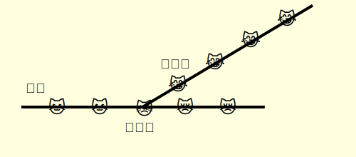

# 第一章 比特币的启迪

T·S·艾略特：

> 我们必不可停止探索，而一切探索的尽头，就是重回起点，并对起点有初次认识般的了解。

比特币只有个币，而以太坊在它问世后五年，就已经一纸白皮书从技术上超越了它。但16年来，比特币就是牛币！它一直高居区块链市值榜首。 2025年1月7日，比特币市值占比高达56.4%，排名第二的 ETH 市值占比仅为12.3%！ 耐人寻味不是吗？

### 工作量证明

本小节内容也可以直接看视频：


已经发布在Bilibili的视频


到目前为止，极少有人真的理解透了比特币的工作量证明！\
现在我们就追本溯源，重新翻开中本聪在十六年前发表的《比特币白皮书》：\
[https://bitcoin.org/files/bitcoin-paper/bitcoin\_zh\_cn.pdf](https://bitcoin.org/files/bitcoin-paper/bitcoin_zh_cn.pdf)\
英文版：[https://bitcoin.org/bitcoin.pdf](https://bitcoin.org/bitcoin.pdf)

很有意思的是，有个国内的传奇人物李笑来在比特币白皮书发布十年后，也做了一版翻译，阅读起来很流畅（不愧为新东方高级英语教师），但专业性就差远了！如果上面这个版本你感到阅读艰难，可以试试这个[李氏版本](https://github.com/xiaolai/bitcoin-whitepaper-chinese-translation/blob/master/Bitcoin-Whitepaper-EN-CN.md)。

都说开门见山，我们一起来看看《比特币白皮书》的摘要。

> **摘要**：_一种完全的点对点电子货币应当允许在线支付从一方直接发送到另一方，而不需要通过一个金融机构。数字签名提供了部分解决方案，但如果仍需一个可信任的第三方来防止双重支付，那就失去了电子货币的主要优点。我们提出一种使用点对点网络解决双重支付问题的方案。该网络通过将交易哈希进一条持续增长的基于哈希的工作量证明链来给交易打上时间戳，形成一条除非重做工作量证明否则不能更改的记录。最长的链不仅是被见证事件序列的证据，而且也是它本身是由最大 CPU 算力池产生的证据。只要多数的 CPU 算力被不打算联合攻击网络的节点控制，这些节点就将生成最长的链并超过攻击者。这种网络本身只需极简的架构。信息将被尽力广播，节点可以随时离开和重新加入网络，只需接受最长的工作量证明链作为它们离开时发生事件的证据。_

摘要向我们描述的是比特币最重要的核心：工作量证明（Proof-of-Work，简称PoW）。\
工作量证明重要到它贯穿了白皮书的首尾。中本聪在白皮书结尾的最后一句把工作量证明称为一种共识机制：

> Any needed rules and incentives can be enforced with this consensus mechanism.\
> 任何必要的规则和奖励都可以通过这个共识机制来强制实施。

这句话明确告诉我们，工作量证明是一种治理共识，也就是一种治理协议。并且，在中本聪的设计里，工作量证明由两大部分组成：必要的规则和奖励。\
强制实施则说明工作量证明这一共识是一种治理协议。\
（查下英文词典你就知consensus的原意为“a generally accepted opinion or decision or agreement among a group of people”）

所以你看，《比特币白皮书》主要就是在介绍工作量证明，但有点遗憾的是，它本身并没有对工作量证明做一个明确的定义或者完整的描述。

我们看看[维基百科](https://zh.wikipedia.org/zh-hans/%E5%B7%A5%E4%BD%9C%E9%87%8F%E8%AD%89%E6%98%8E)是怎么描述的：\
工作量证明（Proof-of-Work，PoW）是一种对应服务与资源滥用、或是阻断服务攻击的经济对策。\
一般要求使用者进行一些耗时适当的复杂运算，并且答案能被服务方快速验算，以此耗用的时间、设备与能源做为担保成本，以确保服务与资源是被真正的需求所使用。

所以更遗憾的是，维基百科以及其它你现在能快速搜到的网页，它们都有意无意地抓住了中本聪的这一遗漏，并且无视中本聪在《比特币白皮书》里的最后那句话！以及白皮书第六小节对于工作量证明的奖励机制的特别介绍，也就是他们只强调工作怎么做，而不强调奖励的必要性及其意义——在一个资本主义高度发达的时期，“工作量证明”被重点介绍为你要努力打螺丝才能赚到钱，确实很合理。所以令人可惜的是，如果中本聪之前将这个共识机制命名为奖励证明（Proof-of-Reward），强调系统奖励的重要性，可能区块链的发展就大为不同了！

我在我的教材里给的描述是这样的：\
工作量证明是一套以奖励为驱动力、以记账为核心任务的治理共识。

再强调一下，比特币的工作量证明成功的关键，就是它提供了奖励。看第六小节的内容我们知道比特币给矿工设计了双重回报机制：一是所有转账的交易手续费都奖励给矿工。交易手续费没有归中本聪所享有，这个设计就超越了所有的中心化交易所。不过，这种奖励归根结底还是用户贡献的。第二就是比特币通过不断发行给矿工产生的BTC奖励。**比特币的发行总量为2100万，每一个都是通过系统奖励给矿工，慢慢发行出来**——这就是被资本家遮蔽了十多年的比特币的工作量证明所蕴含的惊天大“秘密”！

是的，2100万总量的 BTC 全都是通过系统奖励给矿工而发行出来，这一设计是工作量证明的点睛之笔！我相信中本聪当初主要是想让BTC的发行摆脱资本主义的铜臭味，而采用一种无可挑剔的合理方式。对于这样的设计，我稍换个角度表述就能让很多人惊掉下巴：**中本聪设计出的2100万总量的 BTC 不就是比特币的工作量证明的公共奖励基金吗！！**

那么重点来了：中本聪在 PoW 工作量证明的设计中，抛弃了资本主义的左手画大饼（比特币俗称大饼），右手将技术资本化的典型做法。所谓技术资本化，就是把“电子现金” BTC 作为资本来进行预售，且预售是可以让更多资本家一起来获取剩余价值的一种未来预期行为。中本聪抛弃技术资本化，本质上就是抛弃了地地道道的资本主义生产方式。

因此，更为神奇的是，中本聪对于比特币公共奖励基金的设计思想，意义非凡！它最终会启发人们，按照比特币的工作量证明的这一治理共识所构建的，不是资本主义，而是直指人类社会的一个新文明：共产主义！

……先冷静下……我们继续……

对于比特币的工作量证明，至为重要的还有投票表决，对吧？\
那么我的问题是：是谁在投票？\
你不已经说了是比特币节点吗？\
一个已经有比特币或者其它代币的人，基本上都会说没错就是比特币节点。\
但这只是中本聪设计出的假象。\
其实投票的，是拥有比特币节点的人！

中本聪在白皮书中说：“如果多数的 CPU 算力被诚实节点控制……”，我认为他是太希望大家能够认同他的设计了。因为真实情况应该是“如果多数的 CPU 算力被诚实的人控制……”

那么请问，如果把记账权交给了人，我们能不能确保比特币或者另一条公链以太坊或者任何一条公链的节点被足够多的诚实的人所控制？\
诚实的答案显然只有一个：\
无法确保！

不过这个世界好像除了我，再也没有几个人会对中本聪吹毛求疵。但其实我真心觉得中本聪当初这样设计是非常聪明的。我不认为那时候他还有更好的办法，如果他的离开是因为他知道自己将不久于人世，那就更为合理了。最后，无论如何，实践证明中本聪依靠这一收买人心的策略，成功地为人类世界打开了一扇大门！

但这仍然只是一个很好的临时解决方案。不要被51%这个数字所迷惑！如果我们一味地因循守旧，迟早只要一个人都能颠覆比特币，或者号称不超过2/3的节点作弊都扛得住的以太坊。

这是因为熊市币价下跌，就会淘汰掉一些矿工。这样慢慢淘汰，节点就会聚集到越来越少的人手上。节点运营者的中心化在所难免！\
实际中心化发生的方式更多也更快！如矿池、矿机带来的中心化。\
仅以比特币矿池为例， 它是由矿工组成的集体，矿池成员贡献他们的算力，共同解决复杂的数学问题以获得记账权。当一个区块被挖掘出来时，奖励根据每个参与者贡献的计算能力进行分配。矿池提高了每个矿工的效率和盈利能力， 因此比特币推出5年后，矿池就让独立的矿工彻底失去了生存空间。

当实际掌控权力的人数足够少，譬如少至个位数，而其中有一个敢于胡作非为的坏家伙的时候，记假账的灾难就可能发生。而这个临界值，早就已经成为现实。详见此内容中的最后一节“[**比特币的硬核问题**](https://u.naturaldao.io/be/chapt-1/advantages#bi-te-bi-de-ying-he-wen-ti)”。

所以。比特币的工作量证明或者以太坊山寨的点点币所创新的权益证明或者其他现有的任何治理共识。都是安全性远远不够的，我们应该创建新的治理共识来解决他们的根本问题——先别急，虽然显然你已经猜到这个治理共识叫做价值证明（Proof-of-Value）。

也许还是有人会想，那我们对上面说的那几个人进行治理不就可以避免灾难发生了吗？

中本聪在设计比特币的时候，要对抗的就是这样的想法。他想达到的目标是确保任何国家的政府甚至全地球所有国家的政府联合起来，都无法控制矿工。为此中本聪采用了较为复杂的加密技术。而他的方案也几乎就是达到这一目的的唯一解：\
匿名！\
是的，从记账的矿工到比特币用户，所有参与的人都匿名后，即使全球所有国家的政府都联合起来，也没有办法完全摧毁比特币。秘诀在于比特币本身是公共的（公链），那么记账工作匿名后，任何人都可以通过分叉死里逃生。如果你不懂什么是分叉，你可以阅读[我这个开源的教材的相关内容](https://u.naturaldao.io/be/chapt-1/1.5-shen-me-shi-fen-cha)！\

<figure><figcaption>
公共属性+匿名记账是比特币不可被摧毁的终极法宝
</figcaption></figure>

有人肯定想知道到底比特币是怎么做到让用户都匿名的了。

### 匿名 

成功的匿名技术，是比特币最重大的创新。这部分内容在白皮书的”10. 隐私“一节。

中本聪用这张示意图描述了其新隐私模型和传统隐私模型的不同：

<figure><figcaption></figcaption></figure>

参与交易时，传统市场要求你为第三方（一个或多个中心化机构）提供你的实名信息，但新隐私模型无此要求。\
中本聪的设计利用了密码学原理：当你使用钱包时，钱包为你随机生成一个私钥，唯一的私钥为你产生唯一的公钥，这个公钥再产生唯一的地址。此流程无法反向破解。\
在交易信息中，你的钱包地址和公钥都是公开的，但保持公钥匿名。也就是说，产生这一公钥的私钥会签署交易，即签名，但通过签名信息你无法获知私钥！

<figure><figcaption></figcaption></figure>

很遗憾的是，几乎整个行业的人，在过去7年里，一直认为我们还要另想办法加强保护我们的隐私信息。他们担心两件事：

1. 因为区块链的交易信息是公开透明的，警察和绑架犯通过交易信息里的钱包地址、余额、交易金额和IP地址等信息的分析，找到交易者。
2. 未来如果把他们的健康信息等保存到链上，和上面一样，能够被任何人分析出到底是谁得了艾滋病。

绑架犯要找到有钱人，譬如马斯克，很难吗？张三资产匿名就找不到他，那一定是张三穷吧。\
如果未来是美好的，隐私本身只会越来越小。如果李四天生雌雄俩性器官，今天他是会要求保密的，可我根本就不信未来有人会因此歧视李四。

我觉得中本聪自己都没完全搞明白他的新隐私模型已经足够匿名了。因为私钥是不会示人的，也无人可破解，因此私钥的归属别说其他人，其主人都不一定知道：

* 私钥在不在隔壁老王手上，你永远没有直接证据。犟你就告诉我哪个钱包地址是中本聪的吧。
* 隔壁老王被你屈打成招，交出了私钥，但你还是不可能知道这枚私钥是他自己生成的，还是其他人给他的（这个”其他人“被屈打成招那也可能是另一个人给他的，同样的问题在延伸而已）。
* 你也不可能知道这枚私钥是隔壁老王独有的，还是和其他人一起共享的。不要犟，如果老王和赵六俩人歃血为盟共同管理这枚私钥，那也没用。谁能保证老王或者赵六不会偷偷地把私钥告诉给了他的老婆（请注意老婆要和老王或者赵六对齐，我没别的意思。他们有没有别的意思我不知道）。
* 某人有多少钱包地址，你不可能知道。犟你就告诉我中本聪有几个钱包地址吧。
* 私钥有没有暴露（如被盗），穷主人也可能永远不知道。

一句话总结：\
比特币为人类的未来构建了新隐私模型。

### 货币和支付 

把通证翻译成代币，在投资交易市场是极为贴切的。\
通证（token）的原意是以一样东西代表或者象征另一样东西，后者可以是物质的也可以是精神的，可以是实实在在的也可以是虚拟的。\
我们在游戏厅或者赌场代替人民币使用的，用合金或者塑料制作的圆形物，就是最典型的通证。在这种场合中，代替法定货币使用的它，常常就被称为“代币”。\
那么至此，我们就厘清了一件事：\
通证不等于货币。只是我们不排除一件事：某种通证可能成为未来全球通用的货币。\
别痴心妄想这个中奖者会是比特币。

比特币是一种支付币种。这样说其实是废话，但有人就是搞不清楚。这个世界有不具备支付功能的币种吗？\
重点是，比特币不是一种结算币种！无论你的目的是投资结算，还是其它的交易结算。事实上，如果有人捐赠比特币，捐赠者和受赠人至少有一方智商不在线！

比特币发行总量约2100万枚，考虑到遗失的不断发生，以及科学的度量衡的基本要求，可以肯定它是永远不可能达成其白皮书的目标，即成为电子现金。所谓现金，本质应该是一种通用的结算币种，或者说一种定价货币。而如果要成为现金，那么首先它就不能是一个固定的发行总量，否则市场的需求量增加的时候，它自身的价格能不变吗？！至于定价……你不会选择比特币来做定价货币的，对吧？

就这么简单的道理，过去十年来，却没几个人搞明白。因为貌似所有人都缺乏司空见惯且人人日常都在使用的科学的度量衡知识！

### 区块链价值观（特色） 

中本聪通过比特币，为我们实现区块链价值观带来希望。\
我之所以这样说，其一是因为这些价值观本来就存在于人世间。只是它们无法通过良好的技术保障落地。其二是这些价值观的实现在比特币之上是阶段性的，或者说并不完美。这只是提醒我们要继续努力！

#### 公共（Public）

这一点，体现在白皮书的“2. 交易”以及“6. 奖励”里。

比特币就是一个公开透明的去中心化账单系统，它把账单完全公开透明地交给全球所有的比特币用户监管。比特币的所有转账数据是公开透明的，比特币的所有全节点钱包的代码也都是公开透明的。

2100万枚比特币是作为公共奖励基金，按照预设好的规则和算法，全部发放给诚实的记账者（矿工）。进一步表明比特币就是定位于服务于全人类的公共项目。

#### 去中心化（Decentralized，Decentralization）

比特币被设计为去中心化自治系统。所谓去中心化，是指这个系统自2009年1月3日创世后，即以既定规则在因特网中自主运行，不依赖某个机构的服务器，也无须某个机构来监管。

#### 抗审查（Anti-censorship）

请注意，这里的抗审查指的是比特币交易不可纂改，而并非某件事没有门槛没有限制的那种抗审查。后者叫“无需许可”。

任何比特币交易都是不可撤销的。这也就是说：一个人给你转了账，一旦你收到到账通知，他就不可能单方撤销、偷偷冻结或者收回这笔交易。

我们称比特币的这一特性为抗审查（anti-censorship）。在比特币的实际应用中，抗审查直接体现在没有人可以伪造、修改、撤销或废除交易。这一特性也使得比特币的交易**数据是可永久溯源**的。

#### 无需许可（Permissionless）

无需许可最早是表示所有（任何）节点都可以请求将任何交易添加到区块链中，也就是说你想做矿工就能做。\
还表现在任何人都可以自由地拥有自己的比特币钱包地址，可以用一个删一个（不是开玩笑，比特币钱包早期就是这么干的），想要多少有多少。

#### 毋庸置疑的中立性（Trustless Trust）

这一点，在白皮书的“1. 简介”和“12. 结论”里。\
比特币交易被记账员（矿工）确认后作为账单分发给所有节点确认，并且通常要在系统里总共做6次这样的确认才被最终接纳，再加上所有的账单都是透明可查的，因此交易的参与方不需要相互了解或者彼此信任，不再需要中央银行这样的中介，就能安全可靠地完成交易。

比特币账目完整、完全公开且所有记录永久保存（永远不能被删除或篡改），意味着它就是一个公开透明的分布式账单系统，它把账单完全公开透明地交给全球所有的比特币用户维护。而正因为所有用户都有一份公开透明的账单，至少要事先串通51%的矿工造假，才可能让伪造的交易被整个网络信以为真。因此当匿名矿工数量足够且足够分散时，比特币是值得信赖的。

**请注意，比特币的设计中是存在两大重大问题的！它们决定了比特币公链是不可能成功的。**\
**第一大问题是，比特币没有帐户概念。想要确定某个人拥有的比特币，并无法通过某个账户查到，必须知道此人控制的所有UTXO金额之和。这显然是为了保障所谓的个人资产隐私特地设计成这样。但我们知道对于金融来说，帐户可是其基石。缺乏帐户概念注定了比特币在以太坊出世后，错过吸纳后者在智能合约方面的伟大创新，几乎就是必然。**\
**第二大问题，完美体现在从比特币的共识机制的名称上。工作量证明（Proof of Work）毫无疑问仍然立足于劳动文明即资本主义的劳动价值观。它注定会被人类的新文明所抛弃。**

**不过，我们也可以说，比特币在产生第一个区块的那天，它就已经成功了！**

**总之，比特币带给我们的重点，是其治理思想，而不是其并不完美的技术细节。中本聪不辞而别，是一种功成名就。**\

作者的Enki：[0xdd@daism.io](https://daism.io/smartcommons/actor/0xdd@daism.io)
