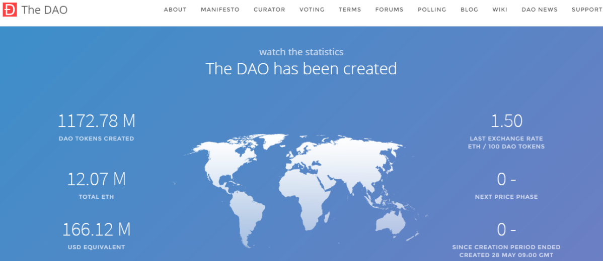

# 第二章 以太坊的锦上花和严重过失

2013年11月的某天，Vitalik Buterin 发布了他写的《以太坊：下一代智能合约和去中心化应用平台》（[A Next-Generation Smart Contract and Decentralized Application Platform](https://ethereum.org/content/whitepaper/whitepaper-pdf/Ethereum\_Whitepaper\_-\_Buterin\_2014.pdf)."）。

这样的[白皮书](https://github.com/ethereum/wiki/wiki/\[%E4%B8%AD%E6%96%87]-%E4%BB%A5%E5%A4%AA%E5%9D%8A%E7%99%BD%E7%9A%AE%E4%B9%A6)标题当然是激动人心的。

白皮书中说，以太坊的目标就是提供一个带有内置的成熟的图灵完备语言的区块链，用这种语言可以创建合约来编码任意状态转换功能，用户只要简单地用几行代码来实现逻辑，就能够创建当时人们所热议的所有货币和金融方面的应用以及许多人们还想象不到的的其它应用。

图灵完备意味着以太坊提供的是全球公共的通用智能合约云服务器——是的，Vitalik 从一开始就将以太坊定位为世界计算机，并且他希望这一愿景在 ETH 2.0 计划中能够得以实现。而提升以太坊效能的分片（sharding）技术就曾是以太坊2.0最主要的攻关目标。当时以太坊采用的从比特币那里山寨来的 PoW 共识机制的效率非常低，每秒仅能处理15笔转账。我们都知道转账是gas（交易手续费）最低的交易类型，如果是合约交互产生的交易，其 gas 高十倍或更高都很正常，那么每秒可能仅能处理一笔甚至零点几笔交易了。而此时倘若又不幸因 ETH 价格暴跌或暴涨导致交易拥堵，gas 再暴增几百倍，可以太坊又有最高gas限制，对多数正在发起交易的用户来说，那就与**宕机**无异了！

整个行业都翘首以盼分片能够大大提升以太坊的性能。早在《BeyondBlock Taipei 2017》会议上， Vitalik 就已经开始推动这一技术更新。整整七年过去，实际发生的却是 ETH 2.0 的流产。而[分片（sharding）](https://ethereum.org/zh/roadmap/#what-about-sharding)则已从技术发展路线图中剔除出去。

显然我们需要彻底的反思！

Vitalik 的区块链职业生涯源于2011年他联合创立的Bitcoin Magazine。可惜的是，这位技术上的天才少年非但没有继承中本聪倾注在 PoW 工作量证明中的治理思想，甚至对于金融的根本作用以及资本所构建的不平等的社会关系，都一无所知。

我们不能苛求的是，比特币因中本聪自身的局限性，其 PoW 工作量证明只实现了一个非常粗糙的软件模型。加上我们迄今尚不得而知其原因的中本聪的突然消失，使得他也没有继续伴随着区块链的实践，通过广泛的开源协作对比特币做进一步的改进。

中本聪留给大家的课业貌似并不多，也就比特币白皮书和Bitcoin 0.1.0（即投入使用的首版）嘛。但绝大多数人不是啃不了代码就是看不懂白皮书，完成不了这一课业。即使他们中的很多人绞尽脑汁去琢磨中本聪留下的其它极为稀少的文字，也于事无补。

譬如，2009年1月3日，中本聪推出创世区块（Genesis Block）时，引用了《泰晤士报》的头版： “即将向银行提供第二轮救助的财政大臣”（The Times 03/Jan/2009 Chancellor on brink of second bailout for banks）。这条讯息被广泛认为是中本聪对2008年金融风暴后英国央行滥发货币的不满。但也正是过于执着于这一信息与货币的关联，反而让所有人忽视了另一种解读。并且这一解读就隐藏在 PoW 工作量证明中：

**资本主义难以为继，比特币是一个不想走资本主义道路的项目。**

我在上一篇文章中已经解读了中本聪的思想：PoW 工作量证明是中本聪对资本主义的宣战！这一点于中本聪而言，无比重要！因为他毫无疑问不是想给资本主义续命，而是在尝试铺就通往人类新文明的道路。若非如此，他煞费苦心地摸索一种建立在去中心化、抗审查、无需许可、公开透明、毋庸置疑的中立性等等特性上的金融体系，不但用上面这句话影射资本主义金融的末日，并且还自始至终坚持隐匿自己的行踪，就一点意义都不存在了！

我们知道，当今人类世界正处于资本主义的统治之下。即资本是人类世界最根本的硬核。马克思早在[《1844年经济学哲学手稿》](https://www.bilibili.com/cheese/play/ss6838?fromspmid=sxgoumai)里就揭示出资本的无可抵挡的沉默的力量：它赋予资本家特殊的社会权力，并用政治权力和以法律为主的社会契约为其提供保障，直至构建起一个以支配、统治、奴役关系为核心骨架的人类世界，即资本主义社会。这也就是说，如果我们还想推动人类社会的进步，那么唯一的办法就是摧毁资本的力量！

中本聪通过 PoW 工作量证明根植于比特币里的人类社会的伟大治理思想，正是马克思的哲学思想！PoW 工作量证明通过比特币落地，也正是马克思所期望的通往共产主义的伟大实践！

令人遗憾的是，2013年以太坊发起时，联合创始人除了资本家，就是想成为资本家的大神。2015年6月30日以太坊上线，其公共区块链迟至7月30日启动。有点诡异是吧？因为早在一年前，以太坊创始团队[发起过一种叫做 ICO 的融资活动](https://www.gemini.com/cryptopedia/initial-coin-offering-explained-ethereum-ico)，并取得巨大成功！

以太坊2014年7月的 ICO，预售出超过6千万个 ETH，融得31000BTC，其时价值1800万美元，另有9.9%的 ETH 留给创始团队无成本预挖，再加9.9%的 ETH 为以太坊基金会无成本预挖。公共区块链的迟到，最重要的原因就是要完成预挖。

这就是被中本聪所唾弃的极为地道的技术资本化，就是把“电子现金” ETH 作为资本来预售，让更多资本家一起来获取剩余价值的资本主义生产方式。是的，以太坊创始团队把”实现世界计算机“这一区块链发展的巨大的技术创新，锁死到了正在给人类社会的进步带来巨大阻碍的资本主义生产方式里。

以太坊资本家的疯狂，还不仅限于此。

2016年4月30日，一个号称去中心化的自治组织 The DAO 在以太坊上诞生，这是一个用智能合约开发的投资项目。在代币销售开始三周后，从超过11,000名资本家那里筹集了占总量14%的 ETH，总价值在1.5\~1.66亿美元波动，使其成为当时历史上最大的众筹活动之一。

这是我在项目结束之前某天截的屏：

<figure><figcaption>
资本家的联合行动没想到被黑客黑了
</figcaption></figure>

The DAO 的宣传语念起来激动人心：

The DAO is revolutionary. \
The DAO is autonomous. \
The DAO is rewarding. \
The DAO is code.&#x20;

嗯，很快我们就会明白，只有第三句才是真正的重点。那是这11,000名资本家最为真实可靠的野心。

我在2016年主编的一本书里介绍过这起事件。6月17日黑客利用 The DAO 智能合约中的bug，劫持了折合人民币5亿元、数量高达360 多万的ETH。以太坊的官方团队第一时间将事件通知了整个社区，并迅速启动拯救计划。最初，以太坊创始人 [Vitalik 提议对以太坊网络进行一次软分叉](https://www.reddit.com/r/ethereum/comments/4oj7ql/personal\_statement\_regarding\_the\_fork/)，增加一段代码，将攻击者列入黑名单，阻止他们转移被盗资金。最终，北京时间7月21日下午2点30分左右，11,000名资本家达成共识，以太坊执行硬分叉，被盗资金被强制回到资本家们的账户里。

（更多细节参阅：[What Was The DAO?](https://www.gemini.com/cryptopedia/the-dao-hack-makerdao#section-the-response-to-the-dao-hack)、[The Dao 攻击](https://learnblockchain.cn/books/geth/part6/dao.html)）

是的，严肃地说，以太坊的 ICO 遮蔽了中本聪在 PoW 工作量证明中的伟大设计！这主要归因于其创始团队成员认知不足，可作为应用发展基础的它对于区块链的发展因此起到了巨大的阻碍作用。特别是对于之后以太坊生态内成千上万的 dApp 疯狂输出 ICO ，带头大哥以太坊难辞其咎！

而 The DAO 事件的后果就变得更为严峻！包括 Vitalik 在内的11,000名资本家，以实际行动向全世界展示了，为保证其利益，他们如何粗暴地践踏中本聪以呕心沥血的实践构建出的抗审查（anti-censorship）等区块链核心价值。是的，以太坊资本家示范性的作为让整个行业在长达十年的时间里窒碍难行，甚至反而让不少骗子大行其道，伤害了很多人。也让中本聪为之蒙羞！

总之，到目前为止，以太坊有的只是两大治理共识 PoW 和 PoS 的外壳，而违背了它们真正的治理思想。十年宝贵的时间就这样浪费掉了。ETH 2.0 计划的流产，对于以太坊来说就是再正常不过的事情。

那么，一起来想象下，如果我们想要拯救以太坊，中本聪给的首个建议会是什么？

重构出公共治理基金！

必须是这建议。

我2019年发起的项目“道易程”构建了一个新的治理共识，叫做价值证明（Proof-of-Value, PoV）。这个共识的重任之一就是为以太坊重构其公共治理基金，并对包括其自身在内的智能公器（公共品）和通证经济进行治理。

价值证明中引入“[ETH锻造](https://learn.daism.io/zh/docs/whitepaper.html#eth-forge)”，即通过一个智能合约烧毁掉ETH，再采用一个算法给用户锻造出一个新币种UTO。

1. 锻造时，让50个“中本聪”参与，用理论上属于他们的奖励重新建立一个公共基金。名曰“中本聪UTO基金”。
2. 中本聪UTO基金是整个以太坊生态的公共治理基金。
3. UTO是ERC-20类型的通证。也就是说，中本聪UTO基金是通过智能合约和 AI 等来实现其最终的去中心化自治。

有一定经验的人也许会产生这一疑问：为什么我们不重新设计一个新的公链，而继续改造以太坊？

最主要的原因是，以太坊被天才少年 Vitalik 定位为世界计算机后，带来的贡献是巨大的：它拓展了公链的治理范围，增加了对应用程序的某些关键点的基础治理。即吸纳账单的成功治理经验，将智能合约的部署和自运行等交给共识机制去做去中心化治理。这就开辟了区块链特有的 dApp 的发展之旅。

强调一下，关于智能合约这一创新，作为互联网网民的我们，都知道它注定会青史留名。因为只有智能合约，才能构建出真正符合比特币启发出的区块链的所有价值观（要求）的dApp：公共、去中心化、去审查、无需许可、毋庸置疑的中立性。

其二，如果你了解过[EIPs](https://eips.ethereum.org/)，即以太坊改进提案，那么你就知道，以太坊的技术发展凝聚了很多人的心血。&#x20;

我们是致力于构建人类新文明的一群人，我们理当尊重所有人的贡献，我们也相信大家更希望我们能以友好协作的方式继续完善以太坊，而不是踩着它往上爬！

现在问个有意思的问题：就编程语言来说，Java、Go、Pathon、C++……能开发出智能合约吗？

不能。必须使用智能合约编程语言，如Solidity等。

那比特币的核心客户端（Bitcoin core）和Ethereum最重要的客户端是用什么语言开发的呢？

C++和Go。

OK，我们来理理：我们必须用智能合约开发语言如 Solidity 写好代码，部署到以太坊去运行，才能符合我们对区块链合约安全可靠性的要求！

那么，以太坊（公链）和矿工之间的合约完全在智能合约之外执行，这不就有违知行合一了吗？！

对于分别于2009和2012年问世的 Pow 和 PoS 这两种治理共识，其治理能力不够的根本原因就是技术应用的不当：它们都属于用web2技术构建的治理共识。而 PoV 是用web3即智能合约构建的治理共识。从软件的角度说，前者属于app，后者属于dApp，而我们刚说过，只有用智能合约构建出的dApp才能真正达到区块链对安全可靠的要求。用 PoV 价值证明来解决以太坊公链的治理，势在必行。

以太坊有两重结构：执行层和共识层。我们要对共识层进行彻底的改造：

1. 重构出公共的治理基金“中本聪UTO基金”。\
   没有合理奖励机制的共识，是比空中楼阁更糟糕的资本收割机！
2. 采用智能合约来治理自身，我们的研发结果就是 PoV。\
   web2包庇了种种特权，只有智能合约能保证公开透明、公正且可靠。
3. 彻底隔离人的干扰。\
   “[Ethereum's 13,900 nodes are running 1 million validators, with 26% of the supply staked](https://www.theblock.co/post/285262/ethereum-one-million-validators?modal=newsletter)”，这样的标题很多人以为是去中心化，资本家则分外眼红！因为他们看到的是他们的某几个杰出代表的又一次伟大的胜利。区块链不需要资本家作为我们的账房先生！
4. 摒弃区块链大小的限制。\
   有区块链大小限制，就必然有竞价。这就是资本主义的生产方式之一！

PoV 价值证明是一个大工程，道易程完成的是其公共治理基金和一些具体的治理方式，以上任务的每一项，都需要第三方的参与甚至技术的主导。至于需要多少个第三方项目，现在尚不得而知。

接下来的内容，我将继续分享通过道易程的实践获得的认知。
